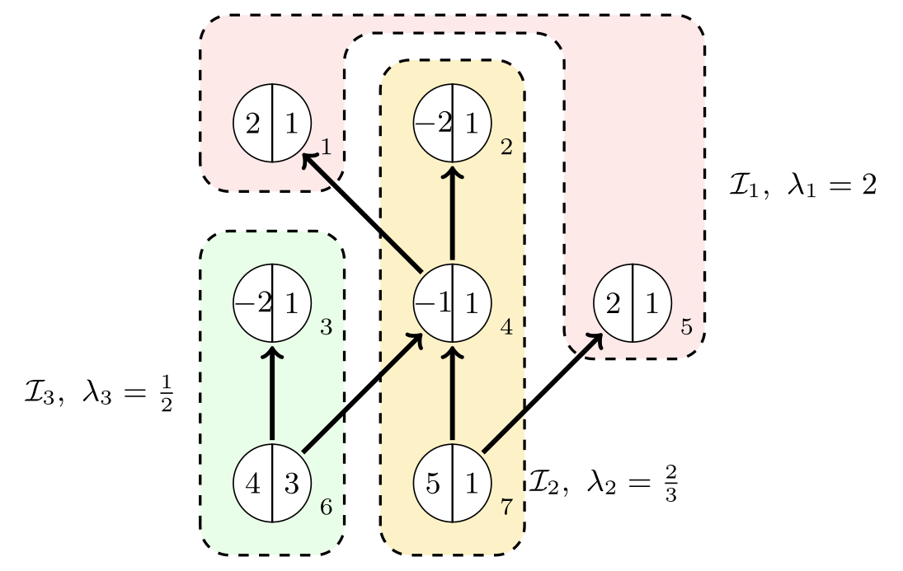

# Parametric Closure on Forests — Source Code, Instances & Results

[](https://github.com/fabiofurini/parametric-closure-forests/actions/workflows/ci.yml)
[](LICENSE)

C++ implementation, benchmark infrastructure, reproducible instances and
raw/processed results for:

> **"On parametric Maximum Closure Problems over precedence forests"**
> Valerio Dose, Fabio Furini, Marco Locatelli

Code, instance generators, benchmark instances and results all live in
this one repository.

The notation follows the manuscript: each vertex has integral profit
$p_i$, strictly positive integral weight $w_i$, and affine contribution
$p_i-\lambda w_i$. A directed arc `(u,v)` means `x_u <= x_v`.

<p align="center">
  
</p>

Each node shows $p_i \mid w_i$, with the small number beside it the vertex
index. For $\lambda$ above 2 the optimal closed set is empty; as $\lambda$
falls past each breakpoint $\lambda_1=2$, $\lambda_2=\tfrac23$,
$\lambda_3=\tfrac12$, one more closure layer becomes worth including, and
the optimal solution only ever grows: $\mathcal M_1=\{1,5\}$, then
$\mathcal M_2=\mathcal M_1\cup\{2,4,7\}$, then
$\mathcal M_3=\mathcal M_2\cup\{3,6\}=\mathcal I$. Every algorithm in this
repository computes this whole nested sequence — all breakpoints and all
closure layers — in one call, rather than solving the plain (non-parametric)
closure problem separately at each $\lambda$.

---

## Algorithms

| Flag | Name | Description | Complexity |
|---|---|---|---|
| `pac` | **PaC** | Peel-and-Contract — direct-scan reference algorithm, arbitrary forest orientation | $O(n^2)$ |
| `dpac` | **DPaC** | Dual of `pac` (increasing ratio order) | $O(n^2)$ |
| `hpac` | **HPaC** | Heap-based Peel-and-Contract | $O(n^2\log n)$ worst case, $O(n\log n)$ typical |
| `dhpac` | **DHPaC** | Dual of `hpac` | as `hpac` |
| `hipac` | **HIPaC** | Heap-based In-tree Peel-and-Contract (in-forests only) | $O(n\log n)$ |
| `hopac` | **HOPaC** | Heap-based Out-tree Peel-and-Contract (out-forests only) | $O(n\log n)$ |
| `rac` | **RaC** | Rake-and-Compress / top-tree algorithm, any tree | $O(n\log n)$ |
| — | **BPPF** | Bounded-Precision Parametric Pseudoflow (Hochbaum et al.), third-party comparison baseline | — |

`PaC`'s two moves (peel the current best final vertices, contract an arc)
are the same pair as `RaC`'s own rake/compress, under a direct-scan or
lazy-heap schedule instead of balanced top-tree rounds. Every algorithm
returns the same object: the ordered sequence of closure layers with exact
rational thresholds, computed with exact integer/rational arithmetic
throughout — no floating point in any decision path.

### HPaC's heap policy (why space is genuinely O(n))

`hpac` (and its dual `dhpac`) keep their candidate heaps within a constant
factor of the live candidate count by a periodic full rebuild that drops
stale lazy-deletion entries. This is what makes the implementation's space
bound match the algorithm's $O(n)$ space theorem on *every* input,
including high-degree hubs: a push-only lazy-deletion heap (kept as
`hpac_lazy`, internal reference) re-pushes one entry per incident edge at
every hub touch and grows to $\Theta(n^2)$ entries on the `star-mixed`
family — measured RSS grows ×100 for n ×10, exhausting an 8 GB ceiling by
`n=20000`. The rebuild policy is also measured *faster* than the lazy heap
(~2× on large random forests, ~4× on stars), with bit-identical output on
every instance tested. `hpac_eager` (an update-in-place `std::set`
variant, also $O(n)$ space) and `hpac_bounded` (an alias of `hpac`) remain
available; all variants are covered by every exhaustive-oracle and
differential-testing check in `pcf_tests`.

### The BPPF comparison

BPPF (`third_party/bppf/`) is used for exactly one purpose in this
repository: the timed comparison of `tools/run_bppf_native_campaign.py`.
One `pcf_bppf` process per instance sweeps, in BPPF's native affine
(two-numbers-per-arc) capacity format, the k+1 parameter values that
bracket all k breakpoints — the same methodology as the v1 manuscript,
and the most favorable setting for BPPF, since it is spared the search
for the breakpoints (upstream BPPF evaluates min cuts only at
user-supplied parameter values). Outside the timed region, one
`pcf_bppf_oracle` run per instance checks that BPPF's closures agree with
`hpac`'s at every probe, classifying any deviation as a fixed-point
tolerance artifact (`prec`, default 1e-6) or a genuine disagreement; a
genuine disagreement invalidates that instance's timing. Correctness of
the algorithms in this repository is established independently of BPPF
(`docs/VALIDATION.md`: exhaustive enumeration oracle plus cross-algorithm
differential agreement).

---

## Quick start

```bash
cmake -S . -B build -DCMAKE_BUILD_TYPE=Release
cmake --build build -j
ctest --test-dir build --output-on-failure

build/pcf_solve --instance instances/mixed_tree.pcf --algorithm rac
```

**Input format** (`.pcf`, one-based vertex ids — full
grammar in [`docs/INSTANCE_FORMAT.md`](docs/INSTANCE_FORMAT.md)):

```text
pcf 1
n 4
profits 10 3 8 -2
weights 2 1 4 1
arcs 3
1 2
3 2
4 3
```

---

## Repository structure

```text
include/, src/     C++ library, CLI solver (pcf_solve) and benchmark runner (pcf_benchmark)
tests/             CTest suite (pcf_tests) — exhaustive oracle + differential checks
tools/             instance generators, benchmark runner, BPPF converter/verifier,
                   aggregation/reporting/packaging pipeline (Python + shell)
third_party/bppf/  unmodified upstream BPPF source — comparison baseline
instances/         committed small fixtures + manifests; bulk archives are
                   generated, not committed (see docs/REPRODUCIBILITY.md)
results/           raw and processed campaign data, LaTeX table fragments
report/            standalone technical report (being regenerated from the V3 sweep)
docs/              full documentation — see below
```

For the full module-by-module breakdown, see
[`docs/ARCHITECTURE.md`](docs/ARCHITECTURE.md).

---

## Documentation

Each topic has its own page:

| Page | Covers |
|---|---|
| [`docs/ARCHITECTURE.md`](docs/ARCHITECTURE.md) | Code layout, algorithm signatures, data model, executables, analysis pipeline |
| [`docs/VALIDATION.md`](docs/VALIDATION.md) | The two independent correctness layers (exhaustive enumeration oracle, cross-algorithm differential testing), sanitizers, CI |
| [`docs/INSTANCE_FORMAT.md`](docs/INSTANCE_FORMAT.md) | The `.pcf` file grammar |
| [`docs/INSTANCE_GENERATION.md`](docs/INSTANCE_GENERATION.md) | The six topology families and six affine-coefficient families, and how each is built |
| [`docs/EXPERIMENTAL_PROTOCOL.md`](docs/EXPERIMENTAL_PROTOCOL.md) | Measurement protocol, statistics, and the official campaign design (A–F) |
| [`docs/RAC_SPECIFICATION.md`](docs/RAC_SPECIFICATION.md) | `RaC`'s implementation contract, frozen against the manuscript |
| [`docs/RAC_AUDIT.md`](docs/RAC_AUDIT.md) | Line-by-line audit of the ported `RaC` source against that contract |
| [`docs/REPRODUCIBILITY.md`](docs/REPRODUCIBILITY.md) | Regenerating instances, rebuilding tables, the clean-clone independence checklist, release contents |

---

## Instances, data & reproducibility

Instances and results live in this same repository, alongside the code:

- `instances/manifests/*.json` — deterministic identifier, topology
  classification, coefficient bounds and SHA-256 checksum for every
  instance, so any regenerated or downloaded archive can be verified
  byte-for-byte (`docs/REPRODUCIBILITY.md`).
- `results/raw/*.csv` — one immutable row per (instance, algorithm,
  repetition), produced by `pcf_benchmark`.
- `results/processed/` and `results/tables/*.tex` — aggregated medians/IQRs
  and the exact LaTeX table fragments used in the manuscript and the
  technical report; regenerated from raw data by `tools/build_report.sh`,
  never hand-typed.

Bulk instance archives (up to $n=100\,000$) and the matching raw/processed
results are attached to
[**GitHub releases**](https://github.com/fabiofurini/parametric-closure-forests/releases)
rather than committed to git history. See
[`docs/REPRODUCIBILITY.md`](docs/REPRODUCIBILITY.md) for the exact
regeneration commands, the full campaign pipeline
(`tools/run_official_campaigns.sh`, `tools/run_bppf_native_campaign.py`,
`tools/build_report.sh`, `tools/package_release.sh`), and the release
contents.

---

## Citation

See [`CITATION.cff`](CITATION.cff).
