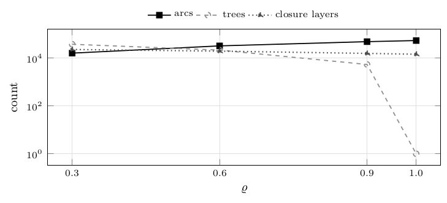
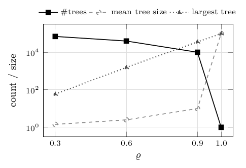
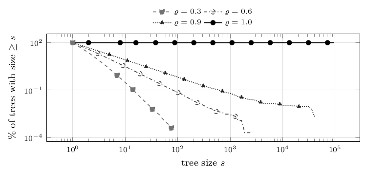
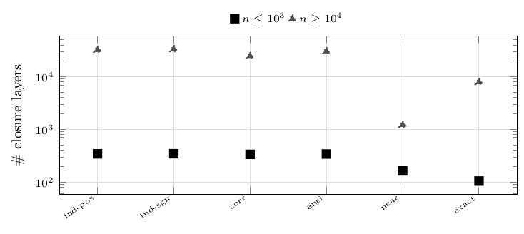
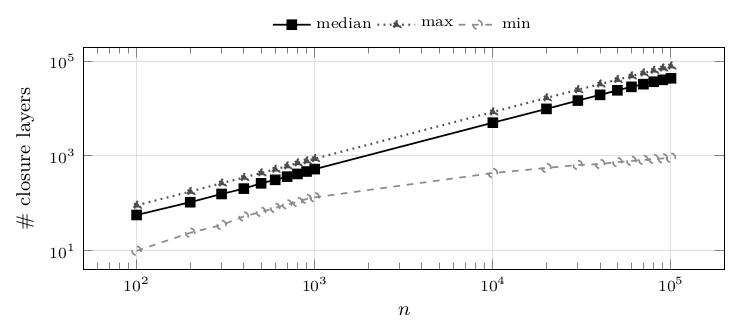
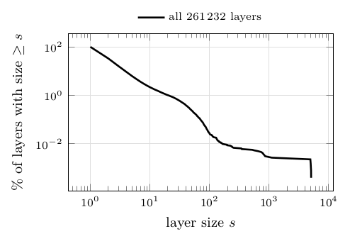

# Instances

An instance of this problem is two independent things: a *precedence structure* (which vertex forces which) and a set of *affine coefficients* (a profit and a weight per vertex). We generate the two separately and cross them, so that any effect observed can be attributed to one or the other. Concretely, one instance is fully determined by four choices: a topology, a coefficient family, a size $n$, and a random seed. Nothing else is tuned – in particular there is no capacity, no time horizon and no scaling of the coefficients.

Files use the `.pcf` format: the arc list, one integer profit and one strictly positive integer weight per vertex, where arc $(u,v)$ encodes the implication $x_u\le x_v$. The format has no capacity field and no reader accepts one – a deliberate choice, since the same algorithms exist in the literature for capacitated variants and we did not want the two to be confusable. Every instance is written by a seeded deterministic Python generator, never by hand, and is recorded in a manifest with its SHA-256 checksum, its topology classification and its coefficient bounds; a regenerated or downloaded archive is therefore verifiable byte-for-byte against the one used here.

Below, each of the two components is described with the rule that generates it. [How big are the closure layers?](05-instances.md#how-big-are-the-closure-layers) then measures what the combination actually produces – how many closure layers, and how big – which is the quantity that governs how much work every algorithm has to do.

### Coefficient families (six)

- `independent-positive`: $w_i,p_i$ independent uniform on $\{1,\dots,1000\}$.
- `independent-signed`: $w_i$ as above, $p_i$ uniform on $\{-1000,\dots,1000\}$.
- `correlated`: $p_i=w_i+\delta_i$, $\delta_i$ uniform on $\{-50,\dots,50\}$.
- `anti-correlated`: $p_i=(1001-w_i)+\delta_i$.
- `near-ties`: one target ratio $\mathrm{num}/\mathrm{den}$ per instance ($\mathrm{num},\mathrm{den}$ uniform on $\{1,\dots,20\}$), then $t_i$ uniform on $\{1,\dots,50\}$, $w_i=\mathrm{den}\,t_i$, $p_i=\mathrm{num}\,t_i+\jmath_i$ with jitter $\jmath_i\in\{-2,-1,1,2\}$.
- `exact-ties`: $g=\max(1,\lfloor n/20\rfloor)$ groups each with its own exact ratio; vertex $i$ goes to group $i\bmod g$, so equal-threshold vertices are spread over the graph rather than adjacent.

### Topologies (six)

`mixed-forest`: each $v\ge2$ linked to a uniform predecessor $u<v$ with probability $\varrho$, each edge oriented $(u,v)$ or $(v,u)$ with probability $1/2$. `in-forest`: one arc $(u,j)$ with $j$ uniform above $u$, with probability $\varrho$ (out-degree $\le1$); `out-forest` symmetric (in-degree $\le1$). `path-mixed`, `binary-mixed`, `star-mixed`: fixed underlying shape (path; balanced binary tree, parent $\lfloor(v-1)/2\rfloor$; star, hub $0$), orientations randomized.

### Sizes and counts

240 instances per topology and size (four densities $\times$ six families $\times$ ten seeds), 60 for the structured families, which have no density parameter. The random topologies use the ten sizes $100,200,\dots,1\,000$ and the ten sizes $10\,000,20\,000,\dots,100\,000$; the structured families use $100$, $200$, $500$, $1\,000$, $2\,000$, $5\,000$, $10\,000$, $20\,000$, $50\,000$ and $100\,000$.

**Figure 1.** Median number of arcs, of trees and of closure layers of the generated instances, per arc density. Instances: `mixed-forest`, $n\in\{10\,000,\dots,100\,000\}$ pooled, 600 instances per density. Observations: what the density parameter actually produces. Arcs grow linearly in $\varrho$ and the number of trees falls accordingly, from $\approx38\,500$ trees at $\varrho=0.3$ to a single spanning tree at $\varrho=1.0$. The number of closure layers moves the other way and far less: connecting the forest removes only about a third of them, because precedence constraints merge layers that would otherwise be distinct. This is why density is a genuine experimental factor and not a cosmetic one.

| $\varrho$ | #inst | median per instance: arcs | trees | closure layers |
|---|---|---|---|---|
| 0.3 | 600 | 16 370 | 38 476 | 23 234 |
| 0.6 | 600 | 32 930 | 21 944 | 19 845 |
| 0.9 | 600 | 49 477 | 5 498 | 15 943 |
| 1.0 | 600 | 54 999 | 1 | 14 718 |

## How many trees, and how big?

[Figure 1](05-instances.md#figure-1) counts the trees of the generated forests; this subsection measures how large they are, because “sparse forest” can mean two very different structures – many trees of comparable size, or one giant tree surrounded by dust – and the two would explain `RaC`'s density sensitivity ([Large sizes, and the effect of density](08-random-forests.md#large-sizes-and-the-effect-of-density)) in different ways. The measurement is made directly on the `.pcf` files by `tools/forest_structure_stats.py`, without running any algorithm: the trees are a property of the input.

Two closed-form facts anchor the numbers. The generator adds each of the $n-1$ candidate arcs independently with probability $\varrho$ and never creates a cycle, so a forest has $\varrho(n-1)$ arcs and therefore exactly $n-\varrho(n-1)$ trees in expectation: the tree count is $(1-\varrho)n$ to first order, and the *mean* tree size is $1/(1-\varrho)$. Both are independent of $n$ – so density, not size, is what sets the fragmentation, and the same density means the same fragmentation at $n=10^3$ and at $n=10^5$.

**Figure 2.** Structure of the generated forests: median number of arcs, median number of trees, trees per vertex, then the median, mean and largest tree size, the largest tree as a percentage of $n$, and the percentage of trees that are isolated vertices; the plot below the table shows the three quantities that move with the density, at $n=100\,000$. Instances: `mixed-forest` at $n\in\{10^3,10^4,10^5\}$, `in-forest` and `out-forest` at $n=10^5$, all four densities, plus the three structured classes at $n=10^5$; 10 instances per row, all with `independent-positive` coefficients, since the topology is generated independently of the coefficients and one family therefore represents all six. Observations: measured values match the closed forms above to three digits – $(1-\varrho)n$ trees, mean size $1/(1-\varrho)$ – and are the same for `mixed-forest`, `in-forest` and `out-forest`, confirming that orientation does not touch the structure; `path-`, `binary-` and `star-mixed` are single trees by construction. The interesting column is the largest tree: at $\varrho=0.3$ and $\varrho=0.6$ it holds $0.1\%$ and $1.6\%$ of the vertices at $n=10^5$, but at $\varrho=0.9$ it holds $36\%$ – while the median tree is *still* a single vertex and half the trees are still isolated vertices.

| class, $n$ | $\varrho$ | #inst | arcs | #trees | trees$/n$ | median | mean | largest | % of $n$ | isolated (%) |
|---|---|---|---|---|---|---|---|---|---|---|
| `binary`, $10^5$ | – | 10 | 99 999 | 1 | 0.000 | 100 000 | 100 000.0 | 100 000 | 100.0 | 0.0 |
| `in`, $10^5$ | 0.3 | 10 | 29 940 | 70 060 | 0.701 | 1 | 1.4 | 65 | 0.1 | 76.9 |
| `in`, $10^5$ | 0.6 | 10 | 59 989 | 40 011 | 0.400 | 1 | 2.5 | 1 196 | 1.2 | 62.4 |
| `in`, $10^5$ | 0.9 | 10 | 89 971 | 10 029 | 0.100 | 1 | 10.0 | 37 940 | 37.9 | 52.6 |
| `in`, $10^5$ | 1.0 | 10 | 99 999 | 1 | 0.000 | 100 000 | 100 000.0 | 100 000 | 100.0 | 0.0 |
| `mixed`, $10^3$ | 0.3 | 10 | 291 | 709 | 0.709 | 1 | 1.4 | 12 | 1.2 | 77.9 |
| `mixed`, $10^3$ | 0.6 | 10 | 599 | 401 | 0.401 | 1 | 2.5 | 61 | 6.1 | 61.7 |
| `mixed`, $10^3$ | 0.9 | 10 | 904 | 96 | 0.096 | 1 | 10.2 | 579 | 57.9 | 52.4 |
| `mixed`, $10^3$ | 1.0 | 10 | 999 | 1 | 0.001 | 1 000 | 1 000.0 | 1 000 | 100.0 | 0.0 |
| `mixed`, $10^4$ | 0.3 | 10 | 3 011 | 6 989 | 0.699 | 1 | 1.4 | 30 | 0.3 | 77.0 |
| `mixed`, $10^4$ | 0.6 | 10 | 6 038 | 3 962 | 0.396 | 1 | 2.5 | 338 | 3.4 | 62.5 |
| `mixed`, $10^4$ | 0.9 | 10 | 8 991 | 1 009 | 0.101 | 1 | 9.9 | 4 448 | 44.5 | 53.2 |
| `mixed`, $10^4$ | 1.0 | 10 | 9 999 | 1 | 0.000 | 10 000 | 10 000.0 | 10 000 | 100.0 | 0.0 |
| `mixed`, $10^5$ | 0.3 | 10 | 29 864 | 70 136 | 0.701 | 1 | 1.4 | 59 | 0.1 | 76.9 |
| `mixed`, $10^5$ | 0.6 | 10 | 60 000 | 40 000 | 0.400 | 1 | 2.5 | 1 561 | 1.6 | 62.6 |
| `mixed`, $10^5$ | 0.9 | 10 | 89 942 | 10 058 | 0.101 | 1 | 10.0 | 36 056 | 36.1 | 52.8 |
| `mixed`, $10^5$ | 1.0 | 10 | 99 999 | 1 | 0.000 | 100 000 | 100 000.0 | 100 000 | 100.0 | 0.0 |
| `out`, $10^5$ | 0.3 | 10 | 30 000 | 70 000 | 0.700 | 1 | 1.4 | 62 | 0.1 | 77.0 |
| `out`, $10^5$ | 0.6 | 10 | 59 992 | 40 008 | 0.400 | 1 | 2.5 | 1 292 | 1.3 | 62.5 |
| `out`, $10^5$ | 0.9 | 10 | 89 968 | 10 032 | 0.100 | 1 | 10.0 | 32 324 | 32.3 | 52.9 |
| `out`, $10^5$ | 1.0 | 10 | 99 999 | 1 | 0.000 | 100 000 | 100 000.0 | 100 000 | 100.0 | 0.0 |
| `path`, $10^5$ | – | 10 | 99 999 | 1 | 0.000 | 100 000 | 100 000.0 | 100 000 | 100.0 | 0.0 |
| `star`, $10^5$ | – | 10 | 99 999 | 1 | 0.000 | 100 000 | 100 000.0 | 100 000 | 100.0 | 0.0 |

**Figure 3.** Distribution of the tree size: for each size $s$, the percentage of trees with at least $s$ vertices, one curve and one column per density; the table lists the same distribution at selected sizes, plus the largest tree observed. Instances: `mixed-forest`, $n=100\,000$, 10 instances per density, 40 in total. Observations: the distribution is heavy-tailed at every density below 1: at $\varrho=0.3$, $77\%$ of the trees are single vertices and only $0.3\%$ reach 10 vertices, yet the largest reaches 96. At $\varrho=0.9$ the tail detaches completely – $30\%$ of trees have $\ge3$ vertices and one tree of $\approx4\cdot10^4$ vertices appears, four orders of magnitude above the median. This is the percolation-like transition that [Figure 14](08-random-forests.md#figure-14) sees as a timing effect: what changes between $\varrho=0.6$ and $\varrho=0.9$ is not the number of trees (it falls smoothly) but the emergence of one giant tree, and `RaC`'s per-component overhead is paid on the count of trees while its contraction rounds are amortized over the giant one.

| $s$ | % of trees with size $\ge s$: $\varrho=0.3$ | $\varrho=0.6$ | $\varrho=0.9$ | $\varrho=1.0$ |
|---|---|---|---|---|
| 1 | 100.00 | 100.00 | 100.00 | 100.00 |
| 2 | 23.04 | 37.48 | 47.25 | 100.00 |
| 3 | 8.64 | 20.47 | 30.48 | 100.00 |
| 5 | 2.22 | 9.30 | 17.63 | 100.00 |
| 10 | 0.31 | 3.06 | 8.19 | 100.00 |
| 100 | 0 | 0.07 | 0.66 | 100.00 |
| 1 000 | 0 | $<0.01$ | 0.07 | 100.00 |
| 10 000 | 0 | 0 | 0.01 | 100.00 |
| largest tree | 96 | 2 866 | 42 153 | 100 000 |
| #inst | 10 | 10 | 10 | 10 |

## How many closure layers?

The number of closure layers is the number of breakpoints, hence an upper bound on the number of iterations of every peeling algorithm: it is the single best predictor of absolute running time. The two figures below report it per coefficient family and per size.

**Figure 4.** Median number of closure layers per coefficient family, reported separately for the small and the large sizes. Instances: `mixed-forest`, all four densities, $n\in\{100,\dots,1\,000\}$ (2 400 instances) and $n\in\{10\,000,\dots,100\,000\}$ (2 400 instances). Observations: how much parametric structure each family creates – the single most useful fact for reading absolute times, since the work of every algorithm scales with the number of breakpoints. At $n\ge10^4$ the median layer count ranges from $1\,222$ (`near-ties`) to $33\,183$ (`independent-signed`), a factor of 27 at equal size. This is why the tie-stressing families are the *fastest* in every timing table below, which would otherwise look counter-intuitive.

| family | #inst | median # closure layers: $n\le 1\,000$ | $n\ge 10\,000$ |
|---|---|---|---|
| `anti-correlated` | 400 | 342 | 30 379 |
| `correlated` | 400 | 337 | 24 825 |
| `exact-ties` | 400 | 105 | 7 884 |
| `independent-positive` | 400 | 344 | 32 374 |
| `independent-signed` | 400 | 346 | 33 183 |
| `near-ties` | 400 | 164 | 1 222 |

**Figure 5.** Median, minimum and maximum number of closure layers, per size. Instances: `mixed-forest`, $n$ from $100$ to $100\,000$, all four densities and six families, 240 instances per size. Observations: the median layer count grows essentially linearly in $n$, settling at $0.43$ layers per vertex ($43\,390$ layers at $n=10^5$): a $10^5$-vertex instance typically has of the order of $4\cdot10^4$ breakpoints to enumerate. The min–max band, however, spans a factor of $86$ at that size ($915$ to $78\,393$), and the reason is not noise but the coefficient families: `near-ties` produces $27\times$ fewer layers than the independent families ([Figure 4](05-instances.md#figure-4)). Two instances of equal size can therefore carry very different amounts of parametric structure, which is the dominant source of instance-to-instance variation in every timing table below.

| $n$ | #inst | # closure layers: median | min | max |
|---|---|---|---|---|
| 100 | 240 | 57 | 10 | 91 |
| 200 | 240 | 106 | 24 | 177 |
| 300 | 240 | 158 | 35 | 267 |
| 400 | 240 | 205 | 53 | 350 |
| 500 | 240 | 265 | 66 | 438 |
| 600 | 240 | 314 | 80 | 521 |
| 700 | 240 | 366 | 95 | 611 |
| 800 | 240 | 418 | 107 | 709 |
| 900 | 240 | 470 | 124 | 782 |
| 1 000 | 240 | 528 | 134 | 873 |
| 10 000 | 240 | 5 032 | 436 | 8 449 |
| 20 000 | 240 | 9 826 | 558 | 16 728 |
| 30 000 | 240 | 14 718 | 645 | 24 852 |
| 40 000 | 240 | 19 434 | 674 | 32 779 |
| 50 000 | 240 | 24 226 | 741 | 40 675 |
| 60 000 | 240 | 28 663 | 787 | 48 463 |
| 70 000 | 240 | 32 662 | 825 | 55 961 |
| 80 000 | 240 | 36 690 | 864 | 63 666 |
| 90 000 | 240 | 40 251 | 888 | 71 224 |
| 100 000 | 240 | 43 390 | 915 | 78 393 |

## How big are the closure layers?

The campaign CSVs record how *many* layers an instance has, not how big they are: the algorithms are timed and their output is discarded. The size distribution is worth one measurement of its own, because it is what a peel step actually consumes. [Figure 6](05-instances.md#figure-6) reports it on a sample of 60 instances at $n=10\,000$ (all six families, four densities, plus stars, paths and in-forests), 261 232 layers in total.

**Figure 6.** Distribution of the closure-layer *size* (number of vertices per layer): the table gives the number of layers, their median, mean and maximum size and the percentage of singleton layers per group; the plot gives the percentage of layers of size at least $s$. Instances: 60 instances at $n=10\,000$ – all six coefficient families and four densities of `mixed-forest`, plus `star-mixed`, `path-mixed` and `in-forest` – for a total of 261 232 layers. Observations: *the distribution is extremely skewed*: overall median 1, mean $2.3$, and two thirds of all layers are singletons – yet the largest single layer holds $5\,077$ vertices, half the graph. So a parametric solution is typically a long chain of one-vertex layers plus a handful of very large blocks, and an algorithm's cost per layer matters more than its cost per vertex. Two group-level facts stand out. The tie-stressing families behave completely differently from the others: `near-ties` has median layer size 7 and *no* singletons at all (by construction, vertices share thresholds), against median 1 and $73$–$75\%$ singletons for the independent families – which is the mechanism behind their much smaller layer counts ([Figure 4](05-instances.md#figure-4)). And density compresses the largest layer by an order of magnitude: on sparse random forests the biggest layer holds $563$ vertices, against $\approx5\,000$ once the graph is a single tree, because a layer cannot straddle components.

| group | #inst | layers | median | mean | max | singletons (%) |
|---|---|---|---|---|---|---|
| `anti-correlated` | 10 | 60402 | 1 | 1.66 | 5029 | 73.1 |
| `correlated` | 10 | 56228 | 1 | 1.78 | 4997 | 68.2 |
| `exact-ties` | 10 | 16072 | 3 | 6.22 | 4960 | 0.0 |
| `independent-positive` | 10 | 61107 | 1 | 1.64 | 5065 | 74.4 |
| `independent-signed` | 10 | 61520 | 1 | 1.63 | 5077 | 75.3 |
| `near-ties` | 10 | 5903 | 7 | 16.94 | 4930 | 0.0 |
| gen, $\varrho=0.3$ | 6 | 33866 | 1 | 1.77 | 563 | 78.3 |
| gen, $\varrho=0.6$ | 6 | 29163 | 1 | 2.06 | 740 | 67.8 |
| gen, $\varrho=0.9$ | 6 | 23724 | 1 | 2.53 | 835 | 59.4 |
| gen, $\varrho=1.0$ | 6 | 22272 | 1 | 2.69 | 778 | 58.1 |
| in, $\varrho=0.3$ | 6 | 34065 | 1 | 1.76 | 522 | 78.8 |
| in, $\varrho=0.6$ | 6 | 29351 | 1 | 2.04 | 655 | 67.6 |
| in, $\varrho=0.9$ | 6 | 24232 | 1 | 2.48 | 803 | 58.2 |
| in, $\varrho=1.0$ | 6 | 22239 | 1 | 2.70 | 859 | 55.2 |
| `path` | 6 | 22885 | 2 | 2.62 | 1111 | 41.5 |
| `star` | 6 | 19435 | 1 | 3.09 | 5077 | 95.1 |

---

← [Setup](04-setup.md) · [Contents](README.md) · [Validation](06-validation.md) →
