# Random forests

The two random campaigns answer two different questions. At medium sizes the question is whether the heap is worth its maintenance cost ([Medium sizes: direct scan versus heap](08-random-forests.md#medium-sizes-direct-scan-versus-heap)); at large sizes it is how the three surviving algorithms scale, and how much the answer depends on the density of the forest ([Large sizes, and the effect of density](08-random-forests.md#large-sizes-and-the-effect-of-density)).

## Medium sizes: direct scan versus heap

Campaign B runs all five of our algorithms on the same 2 400 instances, which makes it the one place where the primal/dual and scan/heap choices can be compared without any confounding factor. It is also the size range where the heap's overhead is still comparable to its benefit, so it is where the crossover can be located.

**Figure 7.** Median CPU time in milliseconds of the five algorithms, per size. Instances: `mixed-forest`, $n\in\{100,200,\dots,1\,000\}$, 240 instances per size (four densities $\times$ six coefficient families $\times$ ten seeds), 11 repetitions each. Observations: the scan-based and the heap-based algorithms are indistinguishable up to $n\approx300$ and the heap pays off from $n\approx400$ on; each dual tracks its primal over the whole range, which is why the manuscript reports only the primals. The mechanism is the candidate selection: `PaC` re-scans every candidate ratio at every iteration, while `HPaC` extracts the maximum in logarithmic time and refreshes only the candidates touched by the last peel or contraction.

| $n$ | #inst | median CPU time (ms): `PaC` | `DPaC` | `HPaC` | `DHPaC` | `RaC` |
|---|---|---|---|---|---|---|
| 100 | 240 | 0.1 | 0.1 | 0.1 | 0.1 | 0.3 |
| 200 | 240 | 0.2 | 0.2 | 0.2 | 0.2 | 0.6 |
| 300 | 240 | 0.3 | 0.3 | 0.3 | 0.3 | 0.9 |
| 400 | 240 | 0.5 | 0.5 | 0.3 | 0.3 | 1.2 |
| 500 | 240 | 0.7 | 0.7 | 0.4 | 0.4 | 1.4 |
| 600 | 240 | 0.9 | 1.0 | 0.5 | 0.5 | 1.8 |
| 700 | 240 | 1.2 | 1.3 | 0.6 | 0.6 | 2.0 |
| 800 | 240 | 1.8 | 1.6 | 0.8 | 0.7 | 2.7 |
| 900 | 240 | 2.2 | 2.0 | 0.9 | 0.8 | 3.3 |
| 1 000 | 240 | 2.2 | 2.4 | 0.9 | 0.9 | 3.0 |

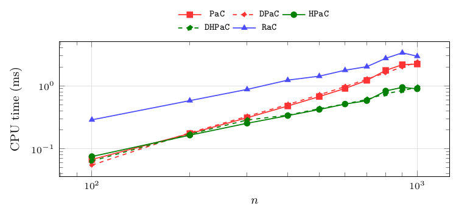

**Figure 8.** Median of the paired per-instance ratio `PaC`/`HPaC`, per size, with the number of paired instances and the IQR of the ratio. Instances: `mixed-forest`, $n\in\{100,200,\dots,1\,000\}$, 240 instances per size. Observations: the ratio is $0.91$ at $n=100$ – the scan is marginally faster where heap maintenance does not yet pay for itself – crosses 1 near $n=400$ and reaches $2.3$ at $n=1\,000$. Beyond this range it keeps growing, $20.3$ at $n=10^4$ and $42.9$ at $n=2\cdot10^4$ ([Large sizes, and the effect of density](08-random-forests.md#large-sizes-and-the-effect-of-density)), which is the practical meaning of the $\mathcal O(n^2)$ bound against $\mathcal O(n\log n)$ behaviour in practice. The dashed line marks parity.

| $n$ | #inst | median `PaC`/`HPaC` | IQR |
|---|---|---|---|
| 100 | 240 | 0.910 | 0.609 |
| 200 | 240 | 1.06 | 0.747 |
| 300 | 240 | 1.19 | 0.879 |
| 400 | 240 | 1.31 | 1.06 |
| 500 | 240 | 1.45 | 1.27 |
| 600 | 240 | 1.65 | 1.37 |
| 700 | 240 | 1.79 | 1.49 |
| 800 | 240 | 1.94 | 1.72 |
| 900 | 240 | 2.06 | 1.96 |
| 1 000 | 240 | 2.29 | 2.13 |

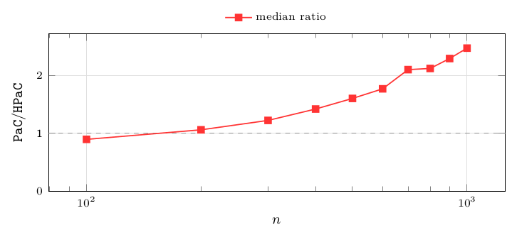

**Figure 9.** Median CPU time in milliseconds of `PaC`, `HPaC` and `RaC`, per arc density. Instances: `mixed-forest`, $n\in\{100,\dots,1\,000\}$ pooled, 600 instances per density. Observations: every algorithm slows down as the forest becomes more connected – more arcs mean more closure sums to propagate – but by very different factors from $\varrho=0.3$ to $\varrho=1.0$: $4.5\times$ for `HPaC` ($0.2$ to $0.9$ ms), $3.8\times$ for `RaC` ($0.6$ to $2.3$ ms) and only $1.5\times$ for `PaC` ($0.6$ to $0.9$ ms), which maintains nothing and therefore has nothing to refresh when the forest gains arcs. `HPaC` overtakes `PaC` on sparse forests and merely draws level with it on single spanning trees: the heap's advantage at these sizes comes from the sparse end. This is the medium-size beginning of the density effect that dominates [Large sizes, and the effect of density](08-random-forests.md#large-sizes-and-the-effect-of-density).

| $\varrho$ | #inst | median CPU time (ms): `PaC` | `HPaC` | `RaC` |
|---|---|---|---|---|
| 0.3 | 600 | 0.6 | 0.2 | 0.6 |
| 0.6 | 600 | 0.7 | 0.3 | 1.2 |
| 0.9 | 600 | 0.8 | 0.7 | 2.1 |
| 1.0 | 600 | 0.9 | 0.9 | 2.3 |

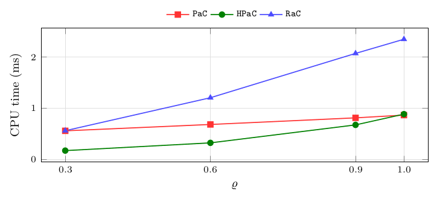

**Figure 10.** Median CPU time in milliseconds of `PaC`, `HPaC` and `RaC`, per coefficient family. Instances: `mixed-forest`, $n\in\{100,\dots,1\,000\}$ and all four densities pooled, 400 instances per family. Observations: the two tie-stressing families are the fastest for `PaC` ($0.5$–$0.6$ against $0.8$ ms) and for `HPaC` ($0.3$ against $0.4$ ms), consistently with their smaller layer counts ([Figure 4](05-instances.md#figure-4)) – fewer breakpoints, fewer iterations – while for `RaC` the six families all sit at $1.2$–$1.3$ ms, indistinguishable at this resolution. The ordering between algorithms is the same in all six families, so no family reverses a conclusion.

| family | #inst | median CPU time (ms): `PaC` | `HPaC` | `RaC` |
|---|---|---|---|---|
| `anti-correlated` | 400 | 0.8 | 0.4 | 1.2 |
| `correlated` | 400 | 0.8 | 0.4 | 1.2 |
| `exact-ties` | 400 | 0.5 | 0.3 | 1.2 |
| `independent-positive` | 400 | 0.8 | 0.4 | 1.3 |
| `independent-signed` | 400 | 0.8 | 0.4 | 1.2 |
| `near-ties` | 400 | 0.6 | 0.3 | 1.2 |

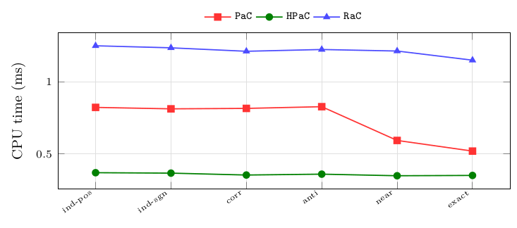

**Figure 11.** Median of the paired per-instance ratio `RaC`/`HPaC`, per coefficient family, with the number of paired instances and the IQR. Instances: `mixed-forest`, $n\in\{100,\dots,1\,000\}$ and all four densities pooled, 400 instances per family. Observations: the ratio is flat at $3.1$–$3.3$ across all six families – at these sizes the coefficient family changes how much work there is, not which algorithm does it faster.

| family | #inst | median `RaC`/`HPaC` | IQR |
|---|---|---|---|
| `anti-correlated` | 400 | 3.12 | 0.674 |
| `correlated` | 400 | 3.17 | 0.684 |
| `exact-ties` | 400 | 3.30 | 0.724 |
| `independent-positive` | 400 | 3.19 | 0.633 |
| `independent-signed` | 400 | 3.18 | 0.636 |
| `near-ties` | 400 | 3.17 | 0.723 |

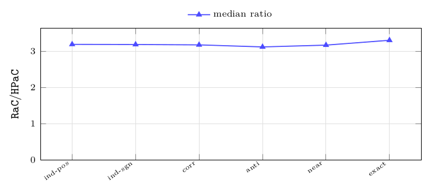

## Large sizes, and the effect of density

Campaign C drops the two direct-scan algorithms beyond $n=20\,000$ (their quadratic growth is established by then) and asks the question that matters at scale: how do `HPaC`, its dual and `RaC` compare on forests with up to $10^5$ vertices, and how much of the answer depends on the density of the forest. As it turns out, more than it depends on the size.

**Figure 12.** Median CPU time in milliseconds of `HPaC`, `DHPaC` and `RaC`, per size. Instances: `mixed-forest`, $n\in\{10\,000,20\,000,\dots,100\,000\}$, 240 instances per size (four densities $\times$ six families $\times$ ten seeds), 3 repetitions each. Observations: `HPaC` computes the full parametric solution on $10^5$ vertices in about $0.2$ s ($203.9$ ms). The paired ratio `DHPaC`/`HPaC` stays between $0.96$ and $1.24$ over the range, so the primal/dual choice is immaterial at scale – the difference is small enough that the median columns of the table and the paired ratio need not rank the two the same way at $n=10^5$. `RaC` is above both at every size, by a factor that grows with $n$ ([Figure 13](08-random-forests.md#figure-13)).

| $n$ | #inst | median CPU time (ms): `HPaC` | `DHPaC` | `RaC` |
|---|---|---|---|---|
| 10 000 | 240 | 12.7 | 13.2 | 50.5 |
| 20 000 | 240 | 28.0 | 29.8 | 131.5 |
| 30 000 | 240 | 44.9 | 47.2 | 262.8 |
| 40 000 | 240 | 62.9 | 66.9 | 399.7 |
| 50 000 | 240 | 84.3 | 92.3 | 543.9 |
| 60 000 | 240 | 96.1 | 117.9 | 652.5 |
| 70 000 | 240 | 117.4 | 141.7 | 837.0 |
| 80 000 | 240 | 141.1 | 161.5 | 1 027.5 |
| 90 000 | 240 | 164.9 | 198.1 | 1 304.7 |
| 100 000 | 240 | 203.9 | 214.6 | 1 709.4 |

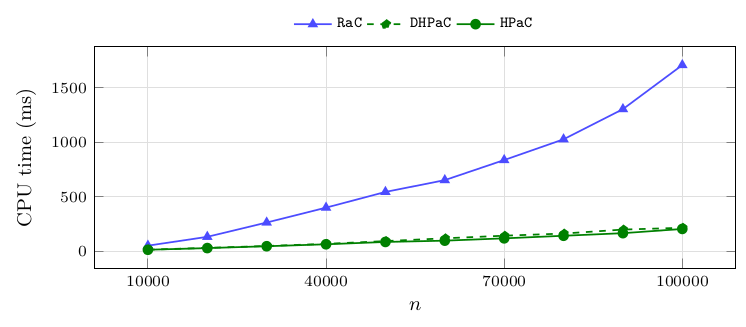

**Figure 13.** Median of the paired per-instance ratio `RaC`/`HPaC`, per size, with the number of paired instances and the IQR. Instances: `mixed-forest`, $n\in\{10\,000,\dots,100\,000\}$, 240 instances per size. Observations: the ratio grows from $4.2$ at $n=10^4$ to $13.3$ at $n=10^5$, and its IQR widens with $n$ as well, so `RaC`'s disadvantage grows *and* becomes more variable. The variability is not noise: it is the mixture of the four densities, which [Figure 14](08-random-forests.md#figure-14) separates.

| $n$ | #inst | median `RaC`/`HPaC` | IQR |
|---|---|---|---|
| 10 000 | 240 | 4.18 | 2.34 |
| 20 000 | 240 | 5.10 | 4.29 |
| 30 000 | 240 | 6.13 | 6.40 |
| 40 000 | 240 | 7.10 | 8.02 |
| 50 000 | 240 | 7.86 | 9.82 |
| 60 000 | 240 | 9.21 | 13.01 |
| 70 000 | 240 | 10.37 | 15.36 |
| 80 000 | 240 | 11.29 | 16.89 |
| 90 000 | 240 | 12.47 | 18.37 |
| 100 000 | 240 | 13.26 | 19.45 |

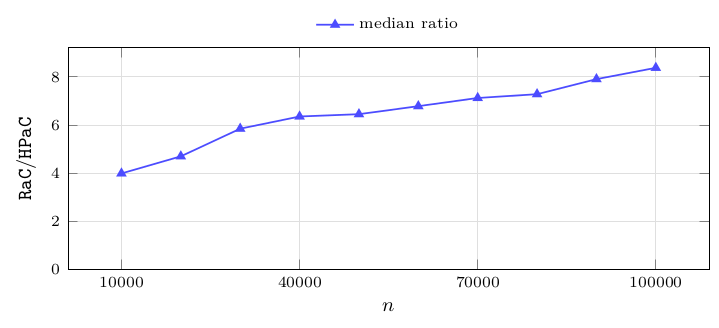

**Figure 14.** Median of the paired per-instance ratio `RaC`/`HPaC`, per arc density, with the number of paired instances and the IQR. Instances: `mixed-forest`, $n\in\{10\,000,\dots,100\,000\}$ pooled, 600 instances per density. Observations: the ratio is $12.9$ at $\varrho=0.3$, $17.0$ at $\varrho=0.6$, $5.0$ at $\varrho=0.9$ and only $2.0$ on single spanning trees, with the IQR shrinking from $10.2$ to $0.4$ in the same direction. A sparse forest splits into tens of thousands of tiny trees ([Figure 2](05-instances.md#figure-2)), on which `HPaC`'s contractions are almost free while `RaC` still pays cluster bookkeeping per tree; on one spanning tree the two are closest. The ordering never reverses, but the margin varies by almost an order of magnitude – the population is a mixture of four regimes, which is exactly what the widening IQR of [Figure 13](08-random-forests.md#figure-13) is made of, and the reason a single aggregate over densities would mislead.

| $\varrho$ | #inst | median `RaC`/`HPaC` | IQR |
|---|---|---|---|
| 0.3 | 600 | 12.92 | 10.24 |
| 0.6 | 600 | 17.03 | 12.52 |
| 0.9 | 600 | 4.97 | 1.89 |
| 1.0 | 600 | 2.00 | 0.359 |

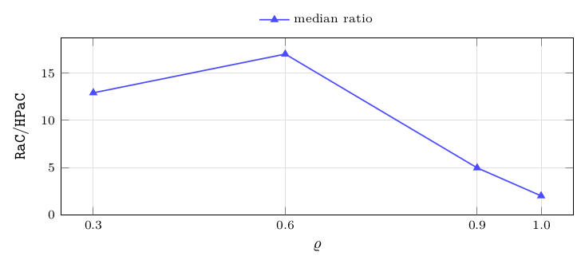

**Figure 15.** Median CPU time in milliseconds of `RaC`, `DHPaC` and `HPaC`, per arc density. Instances: `mixed-forest`, $n\in\{10\,000,\dots,100\,000\}$ pooled, 600 instances per density. Observations: this is [Figure 14](08-random-forests.md#figure-14) in absolute terms, and the two algorithms respond to density in opposite ways. `HPaC` grows monotonically, by a factor 8 from $\varrho=0.3$ to $\varrho=1.0$ ($27.8$ to $221.4$ ms): more arcs mean more closure sums to propagate per move. `RaC` is *non-monotone* – it peaks at $\varrho=0.6$ ($902$ ms) and falls to $433$ ms on single spanning trees – because its cost is a per-tree overhead plus contraction work per tree: at $\varrho=0.3$ there are $\approx 70\,000$ trees but $77\%$ are isolated vertices and cost nothing to contract, at $\varrho=0.6$ there are still $40\,000$ trees and most are non-trivial (the worst combination), and from $\varrho=0.9$ on the count collapses and the work concentrates in one large tree, where the $\mathcal O(\log n)$ contraction rounds are amortized best ([Figure 2](05-instances.md#figure-2) and [Figure 3](05-instances.md#figure-3)).

| $\varrho$ | #inst | median CPU time (ms): `HPaC` | `DHPaC` | `RaC` |
|---|---|---|---|---|
| 0.3 | 600 | 27.8 | 34.4 | 349.2 |
| 0.6 | 600 | 52.4 | 62.3 | 902.1 |
| 0.9 | 600 | 140.7 | 159.3 | 709.4 |
| 1.0 | 600 | 221.4 | 261.4 | 432.7 |

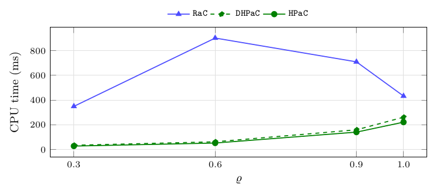

**Figure 16.** Median CPU time in milliseconds of `RaC`, `DHPaC` and `HPaC`, per coefficient family. Instances: `mixed-forest`, $n\in\{10\,000,\dots,100\,000\}$ and all four densities pooled, 400 instances per family. Observations: the spread across the six families is $14\%$ for `HPaC` ($62.0$–$70.7$ ms), $16\%$ for `DHPaC` and $15\%$ for `RaC` ($490$–$563$ ms) – an order of magnitude less than the spread across densities in [Figure 15](08-random-forests.md#figure-15), and in the same direction for all three algorithms, `near-ties` and `exact-ties` being the fastest for each of them.

| family | #inst | median CPU time (ms): `HPaC` | `DHPaC` | `RaC` |
|---|---|---|---|---|
| `anti-correlated` | 400 | 68.5 | 78.2 | 563.3 |
| `correlated` | 400 | 67.2 | 75.6 | 543.8 |
| `exact-ties` | 400 | 63.0 | 71.2 | 505.1 |
| `independent-positive` | 400 | 70.7 | 79.2 | 559.9 |
| `independent-signed` | 400 | 70.2 | 77.8 | 552.1 |
| `near-ties` | 400 | 62.0 | 68.0 | 490.3 |

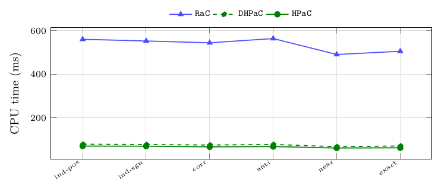

**Figure 17.** Median of the paired per-instance ratio `RaC`/`HPaC`, per coefficient family, with the number of paired instances and the IQR. Instances: `mixed-forest`, $n\in\{10\,000,\dots,100\,000\}$ and all four densities pooled, 400 instances per family. Observations: the ratio lies between $5.80$ and $6.11$ in all six families, a $5\%$ spread. Read against [Figure 14](08-random-forests.md#figure-14), where the same ratio moves between $2.0$ and $17.0$, this is the clearest single statement of the study: the topology decides which algorithm wins, the coefficient family only how much work there is to do.

| family | #inst | median `RaC`/`HPaC` | IQR |
|---|---|---|---|
| `anti-correlated` | 400 | 6.00 | 11.17 |
| `correlated` | 400 | 6.02 | 11.49 |
| `exact-ties` | 400 | 5.98 | 13.35 |
| `independent-positive` | 400 | 5.80 | 11.05 |
| `independent-signed` | 400 | 5.90 | 10.99 |
| `near-ties` | 400 | 6.11 | 13.38 |

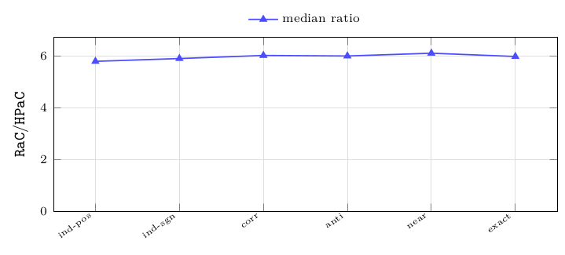

## What the random campaigns say

Three things follow from [Figure 7](08-random-forests.md#figure-7), [Figure 8](08-random-forests.md#figure-8), [Figure 12](08-random-forests.md#figure-12), [Figure 13](08-random-forests.md#figure-13), [Figure 14](08-random-forests.md#figure-14) and [Figure 17](08-random-forests.md#figure-17) and are worth stating explicitly, because none of them is visible from the complexity bounds alone.

- **The heap is worth it, but only past a size threshold.** Below $n\approx300$ the direct scan is as good and at $n=100$ marginally better: the heap's maintenance is not amortized yet. The threshold is small enough that it does not matter in practice, but it does mean that for tiny instances the simpler algorithm is the right choice.
- **Density is a first-order factor, and it acts against `RaC`.** The `RaC`/`HPaC` ratio moves from $2.0$ to $17.0$ as $\varrho$ goes from $1.0$ to $0.6$ – a bigger swing than going from $n=10^4$ to $n=10^5$ at fixed density. Anyone benchmarking these algorithms on a single density would draw a substantially wrong conclusion about the margin. The reason is structural: `RaC` pays cluster bookkeeping per component, and a sparse forest is thousands of tiny components.
- **The coefficient family is a second-order factor.** It changes absolute times by at most $14\%$ and the paired ratio by less than $6\%$, even though it changes the number of closure layers by a factor of 27 ([Figure 4](05-instances.md#figure-4)). Time per layer, not time per vertex, is what the family moves – and it moves it for all algorithms together.

---

← [The campaigns](07-the-campaigns.md) · [Contents](README.md) · [Structured classes](09-structured-classes.md) →
