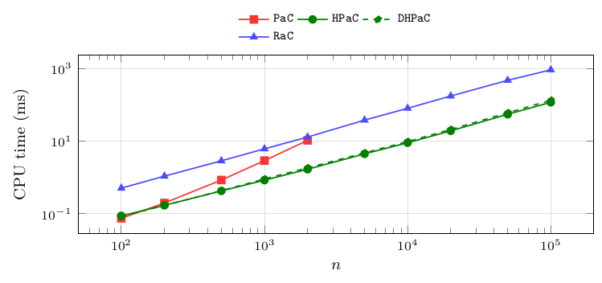
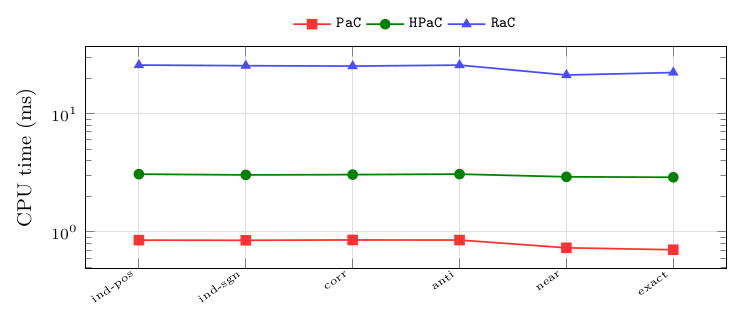
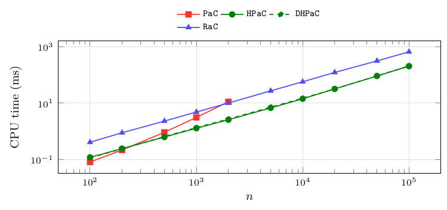
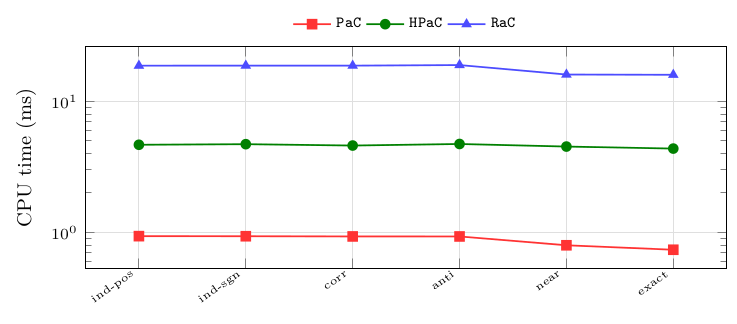
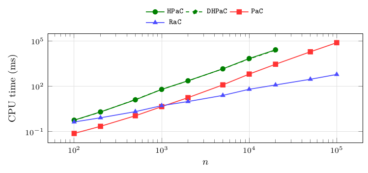
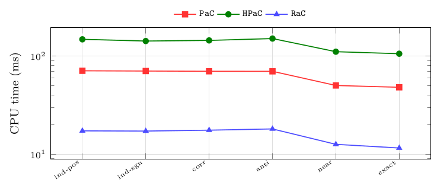
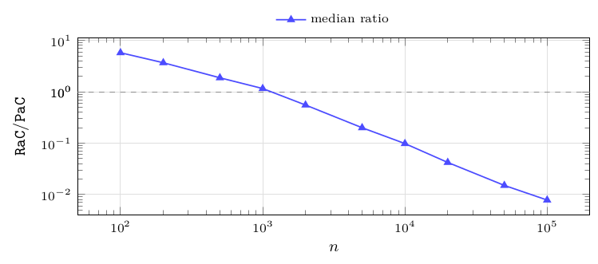

# Structured classes

Paths, balanced binary trees and stars share one property that the random forests do not: the topology is fixed, so only the orientations and the coefficients vary. They therefore isolate the effect of the shape, and they are the classes where the theoretical complexity separation becomes visible. Paths and binary trees confirm the random-forest picture; stars invert it.

**Figure 18.** Median CPU time in milliseconds of `PaC`, `HPaC`, `DHPaC` and `RaC`, per size. Instances: `path-mixed` (one path, random orientations), $n$ from $100$ to $100\,000$, 60 instances per size (six coefficient families $\times$ ten seeds); `PaC` up to $n=2\,000$, its preregistered cutoff. Observations: paths behave like random forests – median `RaC`/`HPaC` between $5.8$ and $9.0$ over the whole range, flat in $n$, and `PaC` left far behind by $n=10^4$ as its $\mathcal O(n^2)$ bound predicts. A path gives `RaC`'s compress rounds no branching to exploit while every vertex has degree $\le2$, so no heap update ever cascades: the shape favours the heap.

| $n$ | #inst | median CPU time (ms): `PaC` | `HPaC` | `DHPaC` | `RaC` |
|---|---|---|---|---|---|
| 100 | 60 | 0.1 | 0.1 | 0.1 | 0.5 |
| 200 | 60 | 0.2 | 0.2 | 0.2 | 1.1 |
| 500 | 60 | 0.8 | 0.4 | 0.4 | 2.9 |
| 1 000 | 60 | 2.9 | 0.8 | 0.9 | 6.1 |
| 2 000 | 60 | 10.5 | 1.7 | 1.8 | 12.9 |
| 5 000 | 60 | – | 4.4 | 4.7 | 37.9 |
| 10 000 | 60 | – | 9.0 | 9.7 | 80.5 |
| 20 000 | 60 | – | 19.2 | 20.9 | 175.3 |
| 50 000 | 60 | – | 54.9 | 60.6 | 475.8 |
| 100 000 | 60 | – | 117.6 | 134.0 | 926.2 |

**Figure 19.** Median CPU time in milliseconds of `PaC`, `HPaC` and `RaC`, per coefficient family. Instances: `path-mixed`, all sizes pooled ($n$ up to $2\,000$ for `PaC`, up to $100\,000$ for the others), 100 instances per family for `HPaC` and `RaC`. Observations: the family changes absolute times by $22\%$ for `RaC` ($21.2$–$25.8$ ms) and $7\%$ for `HPaC` ($2.9$–$3.1$ ms), with `near-ties` and `exact-ties` the fastest as everywhere else; the paired `RaC`/`HPaC` ratio stays within $6.7$–$8.1$ across the six families, so on paths too the family moves the amount of work and not the ranking. Absolute times pool sizes and are therefore comparable only across families, not against [Figure 18](09-structured-classes.md#figure-18).

| family | #inst | median CPU time (ms): `PaC` | `HPaC` | `RaC` |
|---|---|---|---|---|
| `anti-correlated` | 100 | 0.9 | 3.1 | 25.8 |
| `correlated` | 100 | 0.9 | 3.1 | 25.3 |
| `exact-ties` | 100 | 0.7 | 2.9 | 22.3 |
| `independent-positive` | 100 | 0.9 | 3.1 | 25.8 |
| `independent-signed` | 100 | 0.8 | 3.0 | 25.5 |
| `near-ties` | 100 | 0.7 | 2.9 | 21.2 |

**Figure 20.** Median CPU time in milliseconds of `PaC`, `HPaC`, `DHPaC` and `RaC`, per size. Instances: `binary-mixed` (balanced binary tree, random orientations), $n$ from $100$ to $100\,000$, 60 instances per size; `PaC` up to $n=2\,000$. Observations: the median `RaC`/`HPaC` ratio is between $3.2$ and $3.9$ over the whole range – lower than the $5.8$–$9.0$ of paths, since a balanced tree gives `RaC`'s rake and compress rounds more to work with at each round, while for the heap-based schedules a bounded degree keeps updates cheap on both shapes.

| $n$ | #inst | median CPU time (ms): `PaC` | `HPaC` | `DHPaC` | `RaC` |
|---|---|---|---|---|---|
| 100 | 60 | 0.1 | 0.1 | 0.1 | 0.4 |
| 200 | 60 | 0.2 | 0.2 | 0.2 | 0.9 |
| 500 | 60 | 0.9 | 0.6 | 0.7 | 2.3 |
| 1 000 | 60 | 3.1 | 1.3 | 1.4 | 4.9 |
| 2 000 | 60 | 11.2 | 2.6 | 2.7 | 10.1 |
| 5 000 | 60 | – | 6.8 | 7.2 | 27.3 |
| 10 000 | 60 | – | 14.3 | 15.0 | 57.5 |
| 20 000 | 60 | – | 32.0 | 32.1 | 123.1 |
| 50 000 | 60 | – | 92.3 | 92.5 | 315.6 |
| 100 000 | 60 | – | 205.6 | 211.1 | 663.7 |

**Figure 21.** Median CPU time in milliseconds of `PaC`, `HPaC` and `RaC`, per coefficient family. Instances: `binary-mixed`, all sizes pooled ($n$ up to $2\,000$ for `PaC`, up to $100\,000$ for the others), 100 instances per family for `HPaC` and `RaC`. Observations: the same flat picture as on paths, with a narrower band – $16.0$ to $18.9$ ms for `RaC` and $4.4$ to $4.7$ ms for `HPaC`, i.e. $18\%$ and $7\%$ of spread – and the paired `RaC`/`HPaC` ratio between $3.4$ and $3.8$ across the six families. The two tie-stressing families are again the fastest, and by the same relative amount for both algorithms, which is what “the family sets the amount of work” means quantitatively.

| family | #inst | median CPU time (ms): `PaC` | `HPaC` | `RaC` |
|---|---|---|---|---|
| `anti-correlated` | 100 | 0.9 | 4.7 | 18.9 |
| `correlated` | 100 | 0.9 | 4.6 | 18.7 |
| `exact-ties` | 100 | 0.7 | 4.4 | 16.0 |
| `independent-positive` | 100 | 0.9 | 4.7 | 18.7 |
| `independent-signed` | 100 | 0.9 | 4.7 | 18.7 |
| `near-ties` | 100 | 0.8 | 4.5 | 16.0 |

**Figure 22.** Median CPU time in milliseconds of `HPaC`, `DHPaC`, `PaC` and `RaC`, per size. Instances: `star-mixed` (one hub, $n-1$ leaves, random orientations), $n$ from $100$ to $100\,000$, 60 instances per size; the heap-based algorithms up to $n=20\,000$, `PaC` and `RaC` over the full range. Observations: this is the class that inverts the ordering. `RaC` is already faster at $n=100$ and $\approx250\times$ faster at $n=20\,000$. Every peel or contraction touches the hub and invalidates the candidate ratios of a constant fraction of the remaining leaves, so *any* heap-based schedule pays $\Theta(n)$ maintenance per event, while `RaC`'s rake operations absorb all leaves in $\mathcal O(\log n)$ rounds regardless of the hub's update history. `PaC`, which maintains no candidate structure at all, stays an order of magnitude below `HPaC` – on this class the schedule that maintains nothing beats the one that maintains a heap.

| $n$ | #inst | median CPU time (ms): `PaC` | `HPaC` | `DHPaC` | `RaC` |
|---|---|---|---|---|---|
| 100 | 60 | 0.1 | 0.6 | 0.6 | 0.4 |
| 200 | 60 | 0.2 | 2.0 | 2.0 | 0.8 |
| 500 | 60 | 1.1 | 12.6 | 13.2 | 2.1 |
| 1 000 | 60 | 4.5 | 62.0 | 62.0 | 5.2 |
| 2 000 | 60 | 17.6 | 231.2 | 226.1 | 9.7 |
| 5 000 | 60 | 123.7 | 1 427.5 | 1 429.4 | 24.7 |
| 10 000 | 60 | 643.1 | 6 898.7 | 6 479.8 | 63.3 |
| 20 000 | 60 | 2 890.8 | 26 127.1 | 24 619.1 | 122.1 |
| 50 000 | 60 | 19 336.1 | – | – | 291.7 |
| 100 000 | 60 | 77 541.1 | – | – | 606.8 |

**Figure 23.** Median CPU time in milliseconds of `PaC`, `HPaC` and `RaC`, per coefficient family. Instances: `star-mixed`, all sizes pooled ($n\le20\,000$ for `HPaC`, up to $100\,000$ for `PaC` and `RaC`), 100 instances per family. Observations: the inversion of [Figure 22](09-structured-classes.md#figure-22) is present in every family and its size barely moves – the paired `RaC`/`HPaC` ratio lies between $0.060$ and $0.064$ in all six – so the inversion is purely topological: no coefficient family produces it and none removes it. Note the vertical scale: `HPaC` is two orders of magnitude above `RaC` on this class, whereas on every other class it is below.

| family | #inst | median CPU time (ms): `PaC` | `HPaC` | `RaC` |
|---|---|---|---|---|
| `anti-correlated` | 100 | 69.9 | 151.0 | 18.1 |
| `correlated` | 100 | 70.0 | 144.5 | 17.6 |
| `exact-ties` | 100 | 48.1 | 105.7 | 11.6 |
| `independent-positive` | 100 | 70.8 | 148.2 | 17.3 |
| `independent-signed` | 100 | 70.4 | 142.4 | 17.2 |
| `near-ties` | 100 | 50.1 | 110.9 | 12.6 |

**Figure 24.** Median of the paired per-instance ratio `RaC`/`PaC`, per size, with the number of paired instances and the IQR. Instances: `star-mixed`, $n$ from $100$ to $100\,000$, 60 instances per size. Observations: this pairs the two algorithms that are *not* penalized by a candidate structure on a hub, and therefore isolates the asymptotic difference $\mathcal O(n\log n)$ against $\mathcal O(n^2)$ on the shape where it is visible. The crossover sits between $n=1\,000$ and $n=2\,000$ ($1.15$ then $0.52$); at $n=10^5$ the ratio is $0.007$, i.e. `RaC` is $135\times$ faster, and the IQR is below $0.001$, so the effect is uniform over instances and not driven by outliers. Dashed line marks parity.

| $n$ | #inst | median `RaC`/`PaC` | IQR |
|---|---|---|---|
| 100 | 60 | 5.78 | 0.454 |
| 200 | 60 | 3.68 | 0.192 |
| 500 | 60 | 1.88 | 0.120 |
| 1 000 | 60 | 1.15 | 0.053 |
| 2 000 | 60 | 0.524 | 0.034 |
| 5 000 | 60 | 0.198 | 0.016 |
| 10 000 | 60 | 0.100 | 0.005 |
| 20 000 | 60 | 0.043 | 0.004 |
| 50 000 | 60 | 0.015 | 0.001 |
| 100 000 | 60 | 0.007 | 0.000 |

## What the structured classes say

- **Paths and binary trees add no new regime.** The ratios sit where the random forests put them ($5.8$–$9.0$ and $3.2$–$3.9$) and are flat in $n$ over three orders of magnitude: on these shapes the asymptotic advantage of `RaC` never materializes within the sizes we can run.
- **Stars are the counterexample the theory predicts, and they are extreme.** The ratio moves by four orders of magnitude across the size range, from $0.75$ to $0.004$. This is the one place in the study where the complexity separation is not academic.
- **The star penalty is a property of the *schedule*, not of the algorithm.** `PaC` and `HPaC` implement the same algorithm; on stars the heap-based schedule is an order of magnitude slower than the scan-based one ([Figure 22](09-structured-classes.md#figure-22)), because maintaining candidate ratios is exactly what a hub makes expensive. A practitioner facing hub-shaped precedence graphs should reach for `RaC`, and failing that for the direct scan – not for the heap.

---

← [Random forests](08-random-forests.md) · [Contents](README.md) · [Single orientations](10-single-orientations.md) →
