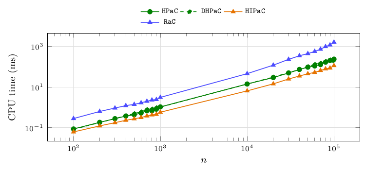
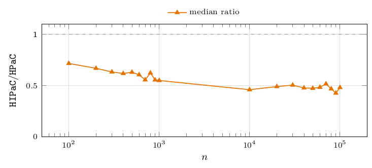
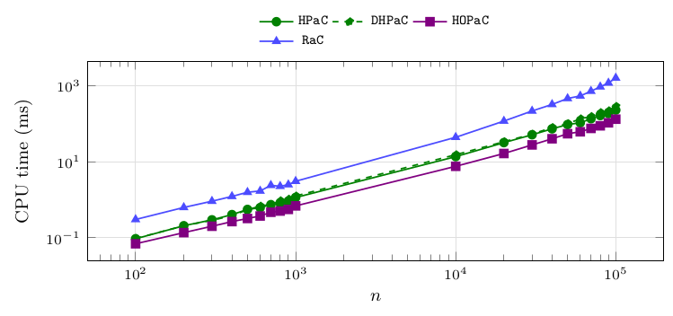
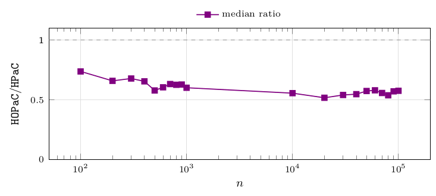
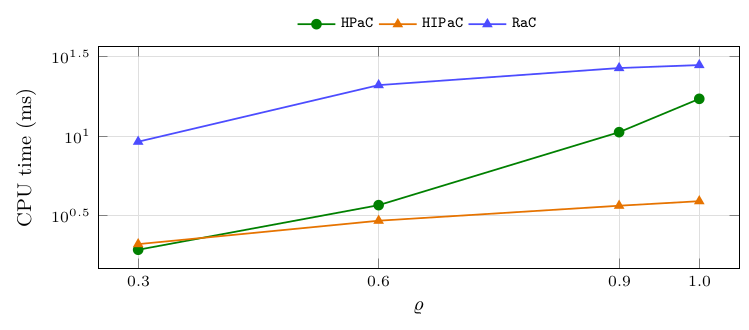
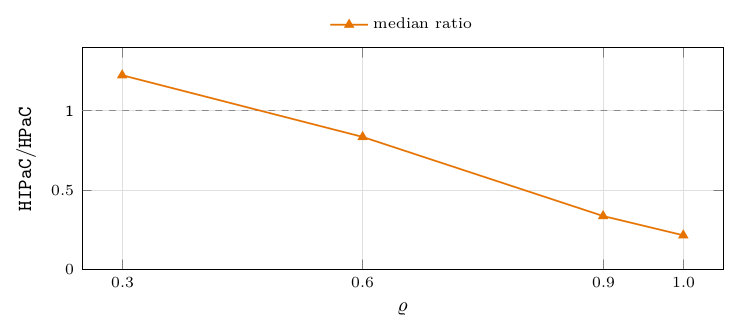
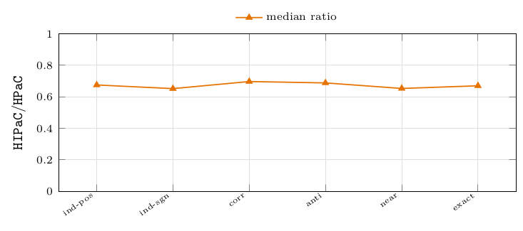
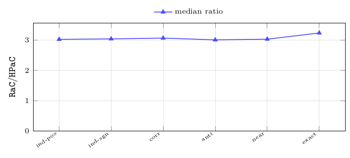

# Single orientations

When the forest is known in advance to be a forest of in-trees or of out-trees, a specialized algorithm can exploit it. This section measures how much that knowledge is worth: it is a constant factor, not a change of regime, and the constant is remarkably stable across sizes, densities and coefficient families.

**Figure 25.** Median CPU time in milliseconds of `HPaC`, `DHPaC`, the specialized `HIPaC` and `RaC`, per size. Instances: `in-forest` (out-degree $\le1$), $n\in\{100,\dots,1\,000\}\cup\{10\,000, \dots,100\,000\}$, 240 instances per size. Observations: `HIPaC` is below `HPaC` at every size and the two curves stay parallel, so the specialization is a constant factor and not a change of regime. The mechanism: on a single orientation the minimal preceding set of every arc collapses to a singleton, so one heap value per vertex suffices and no closure sum is ever propagated.

| $n$ | #inst | median CPU time (ms): `HPaC` | `DHPaC` | `HIPaC` | `RaC` |
|---|---|---|---|---|---|
| 100 | 240 | 0.1 | 0.1 | 0.1 | 0.3 |
| 200 | 240 | 0.2 | 0.2 | 0.1 | 0.6 |
| 300 | 240 | 0.3 | 0.3 | 0.2 | 0.9 |
| 400 | 240 | 0.4 | 0.4 | 0.2 | 1.2 |
| 500 | 240 | 0.4 | 0.5 | 0.3 | 1.4 |
| 600 | 240 | 0.5 | 0.6 | 0.3 | 1.7 |
| 700 | 240 | 0.7 | 0.8 | 0.4 | 2.0 |
| 800 | 240 | 0.7 | 0.8 | 0.4 | 2.3 |
| 900 | 240 | 0.8 | 1.0 | 0.5 | 2.4 |
| 1 000 | 240 | 1.1 | 1.0 | 0.6 | 3.1 |
| 10 000 | 240 | 14.2 | 14.1 | 6.5 | 45.9 |
| 20 000 | 240 | 29.5 | 31.1 | 14.4 | 120.3 |
| 30 000 | 240 | 49.6 | 51.0 | 25.0 | 231.3 |
| 40 000 | 240 | 73.8 | 72.9 | 35.2 | 347.9 |
| 50 000 | 240 | 95.3 | 101.9 | 45.1 | 444.2 |
| 60 000 | 240 | 109.4 | 131.0 | 52.8 | 570.2 |
| 70 000 | 240 | 127.8 | 151.0 | 66.0 | 730.2 |
| 80 000 | 240 | 168.4 | 185.0 | 78.7 | 980.0 |
| 90 000 | 240 | 203.1 | 219.7 | 86.5 | 1 184.7 |
| 100 000 | 240 | 237.6 | 201.7 | 114.2 | 1 620.5 |

**Figure 26.** Median of the paired per-instance ratio `HIPaC`/`HPaC`, per size, with the number of paired instances and the IQR. Instances: `in-forest`, $n$ from $100$ to $100\,000$, 240 instances per size (all four densities and six families). Observations: the ratio lies between $0.52$ and $0.75$ with no erosion up to $n=10^5$ – if anything the advantage grows mildly with $n$. The IQR is large ($0.44$ to $0.82$) because these 240 instances mix four densities, on which the gain differs by a factor 6: [Figure 29](10-single-orientations.md#figure-29) separates them. Dashed line marks parity.

| $n$ | #inst | median `HIPaC`/`HPaC` | IQR |
|---|---|---|---|
| 100 | 240 | 0.749 | 0.445 |
| 200 | 240 | 0.662 | 0.474 |
| 300 | 240 | 0.628 | 0.554 |
| 400 | 240 | 0.615 | 0.553 |
| 500 | 240 | 0.619 | 0.578 |
| 600 | 240 | 0.580 | 0.573 |
| 700 | 240 | 0.565 | 0.597 |
| 800 | 240 | 0.603 | 0.622 |
| 900 | 240 | 0.582 | 0.589 |
| 1 000 | 240 | 0.564 | 0.597 |
| 10 000 | 240 | 0.521 | 0.682 |
| 20 000 | 240 | 0.557 | 0.707 |
| 30 000 | 240 | 0.570 | 0.781 |
| 40 000 | 240 | 0.567 | 0.741 |
| 50 000 | 240 | 0.575 | 0.765 |
| 60 000 | 240 | 0.566 | 0.793 |
| 70 000 | 240 | 0.589 | 0.819 |
| 80 000 | 240 | 0.589 | 0.786 |
| 90 000 | 240 | 0.574 | 0.789 |
| 100 000 | 240 | 0.563 | 0.789 |

**Figure 27.** Median CPU time in milliseconds of `HPaC`, `DHPaC`, the specialized `HOPaC` and `RaC`, per size. Instances: `out-forest` (in-degree $\le1$), $n$ from $100$ to $100\,000$, 240 instances per size. Observations: the picture mirrors the in-forest one of [Figure 25](10-single-orientations.md#figure-25) at every size, as the symmetry of the two constructions predicts; the dual algorithm on the dual class buys the same constant factor, which is also a consistency check on the two implementations.

| $n$ | #inst | median CPU time (ms): `HPaC` | `DHPaC` | `HOPaC` | `RaC` |
|---|---|---|---|---|---|
| 100 | 240 | 0.1 | 0.1 | 0.1 | 0.3 |
| 200 | 240 | 0.2 | 0.2 | 0.1 | 0.6 |
| 300 | 240 | 0.3 | 0.3 | 0.2 | 0.9 |
| 400 | 240 | 0.4 | 0.4 | 0.3 | 1.2 |
| 500 | 240 | 0.6 | 0.5 | 0.3 | 1.6 |
| 600 | 240 | 0.6 | 0.7 | 0.4 | 1.7 |
| 700 | 240 | 0.7 | 0.8 | 0.5 | 2.4 |
| 800 | 240 | 0.8 | 0.9 | 0.5 | 2.3 |
| 900 | 240 | 0.9 | 1.0 | 0.6 | 2.5 |
| 1 000 | 240 | 1.1 | 1.3 | 0.7 | 3.1 |
| 10 000 | 240 | 13.7 | 15.3 | 7.6 | 44.1 |
| 20 000 | 240 | 31.9 | 33.7 | 16.5 | 118.0 |
| 30 000 | 240 | 51.4 | 53.4 | 27.8 | 217.4 |
| 40 000 | 240 | 73.6 | 79.8 | 40.3 | 323.3 |
| 50 000 | 240 | 95.3 | 100.6 | 54.7 | 463.8 |
| 60 000 | 240 | 106.1 | 135.1 | 61.5 | 541.2 |
| 70 000 | 240 | 135.6 | 155.2 | 75.5 | 722.2 |
| 80 000 | 240 | 164.4 | 197.6 | 88.4 | 941.6 |
| 90 000 | 240 | 185.7 | 220.6 | 106.0 | 1 187.5 |
| 100 000 | 240 | 229.5 | 287.2 | 132.1 | 1 608.8 |

**Figure 28.** Median of the paired per-instance ratio `HOPaC`/`HPaC`, per size, with the number of paired instances and the IQR. Instances: `out-forest`, $n$ from $100$ to $100\,000$, 240 instances per size. Observations: the ratio lies between $0.57$ and $0.78$ and is never more than $0.09$ from the in-forest value at the same size ([Figure 26](10-single-orientations.md#figure-26)) – the two specializations are worth the same constant, and neither erodes with $n$. Dashed line marks parity.

| $n$ | #inst | median `HOPaC`/`HPaC` | IQR |
|---|---|---|---|
| 100 | 240 | 0.784 | 0.455 |
| 200 | 240 | 0.676 | 0.477 |
| 300 | 240 | 0.668 | 0.509 |
| 400 | 240 | 0.623 | 0.542 |
| 500 | 240 | 0.663 | 0.555 |
| 600 | 240 | 0.625 | 0.526 |
| 700 | 240 | 0.631 | 0.554 |
| 800 | 240 | 0.622 | 0.571 |
| 900 | 240 | 0.670 | 0.563 |
| 1 000 | 240 | 0.619 | 0.592 |
| 10 000 | 240 | 0.574 | 0.623 |
| 20 000 | 240 | 0.585 | 0.648 |
| 30 000 | 240 | 0.612 | 0.690 |
| 40 000 | 240 | 0.619 | 0.698 |
| 50 000 | 240 | 0.655 | 0.690 |
| 60 000 | 240 | 0.624 | 0.742 |
| 70 000 | 240 | 0.633 | 0.705 |
| 80 000 | 240 | 0.636 | 0.669 |
| 90 000 | 240 | 0.632 | 0.694 |
| 100 000 | 240 | 0.632 | 0.682 |

**Figure 29.** Median CPU time in milliseconds of `HPaC`, the specialized `HIPaC` and `RaC`, per arc density. Instances: `in-forest`, all twenty sizes pooled, 1 200 instances per density. Observations: this is where the specialization's gain actually comes from, and it is *not* uniform. From $\varrho=0.3$ to $\varrho=1.0$, `HPaC` slows down by a factor 9 ($1.9$ to $17.2$ ms) while `HIPaC` slows down by less than a factor 2 ($2.1$ to $3.9$ ms): the paired ratio `HIPaC`/`HPaC` therefore falls from $1.23$ at $\varrho=0.3$ – where the specialization is a small *loss* – to $0.84$, $0.34$ and $0.21$ at $\varrho=0.6$, $0.9$ and $1.0$, a $4.7\times$ gain on single spanning in-trees. The reason is exactly the propagation the specialization removes: on a fragmented forest of mostly isolated vertices ([Figure 2](05-instances.md#figure-2)) there is almost no closure sum to propagate, so `HPaC` pays nothing for its generality and `HIPaC`'s setup cost is not recovered; the more connected the forest, the more the general algorithm propagates. The single figure “$0.52$–$0.75$” of [Figure 26](10-single-orientations.md#figure-26) is thus an average over four quite different regimes.

| $\varrho$ | #inst | median CPU time (ms): `HPaC` | `HIPaC` | `RaC` |
|---|---|---|---|---|
| 0.3 | 1 200 | 1.9 | 2.1 | 9.2 |
| 0.6 | 1 200 | 3.7 | 2.9 | 20.9 |
| 0.9 | 1 200 | 10.6 | 3.6 | 26.8 |
| 1.0 | 1 200 | 17.2 | 3.9 | 28.0 |

**Figure 30.** Median of the paired per-instance ratio `HIPaC`/`HPaC`, per arc density, with the number of paired instances and the IQR. Instances: `in-forest`, all twenty sizes pooled, 1 200 instances per density. Observations: the same effect as [Figure 29](10-single-orientations.md#figure-29) in paired form, which is the form that admits no aggregation artefact – the ratio is computed on each instance and then aggregated. It crosses parity between $\varrho=0.3$ and $\varrho=0.6$, and the IQR stays below $0.17$ throughout, so within one density the effect is tight: the wide IQR of [Figure 26](10-single-orientations.md#figure-26) is entirely the mixture of densities. Practical reading: the specialized variants are worth having when the input is a connected in-tree or out-tree, and worth nothing on a heavily fragmented forest.

| $\varrho$ | #inst | median `HIPaC`/`HPaC` | IQR |
|---|---|---|---|
| 0.3 | 1200 | 1.23 | 0.126 |
| 0.6 | 1200 | 0.836 | 0.084 |
| 0.9 | 1200 | 0.336 | 0.142 |
| 1.0 | 1200 | 0.215 | 0.165 |

**Figure 31.** Median of the paired per-instance ratio `HIPaC`/`HPaC`, per coefficient family, with the number of paired instances and the IQR. Instances: `in-forest`, all sizes and densities pooled, 800 instances per family. Observations: the ratio lies between $0.65$ and $0.70$ in all six families, a $7\%$ spread – against the factor 6 across densities of [Figure 30](10-single-orientations.md#figure-30). There is no family in which the advantage of the specialization disappears, and none in which it is much larger: as everywhere else in this report, the coefficients set the amount of work and the topology sets who wins.

| family | #inst | median `HIPaC`/`HPaC` | IQR |
|---|---|---|---|
| `anti-correlated` | 800 | 0.689 | 0.705 |
| `correlated` | 800 | 0.697 | 0.741 |
| `exact-ties` | 800 | 0.671 | 0.617 |
| `independent-positive` | 800 | 0.676 | 0.710 |
| `independent-signed` | 800 | 0.652 | 0.659 |
| `near-ties` | 800 | 0.653 | 0.620 |

**Figure 32.** Median of the paired per-instance ratio `RaC`/`HPaC`, per coefficient family, with the number of paired instances and the IQR. Instances: `in-forest`, all sizes and densities pooled, 800 instances per family (out-forests give the same values within $6\%$). Observations: the ratio is $3.0$–$3.2$ in every family, i.e. flat as on mixed forests, while by size it grows from about $2.8\times$ at $n\le1\,000$ to $12.8\times$ at $n=10^5$ – so restricting the orientation does not change `RaC`'s standing against the heap-based algorithms, it only removes the need for closure-sum propagation from the latter.

| family | #inst | median `RaC`/`HPaC` | IQR |
|---|---|---|---|
| `anti-correlated` | 800 | 3.01 | 2.17 |
| `correlated` | 800 | 3.07 | 2.30 |
| `exact-ties` | 800 | 3.24 | 2.43 |
| `independent-positive` | 800 | 3.02 | 2.27 |
| `independent-signed` | 800 | 3.04 | 2.26 |
| `near-ties` | 800 | 3.03 | 2.59 |

### Note on the comparison with the first version of the manuscript

The specialized variants were reported there as $4$–$10\times$ faster than the general algorithm, against $1.3$–$1.9\times$ here. The direction is expected – the general `HPaC` is substantially faster than it was, see [Implementation note: heap policy](11-implementation-note-heap-policy.md) – but the magnitude is only partly accounted for by the heap policy: comparing the two heap implementations directly on these instances gives $1.3$–$1.4\times$, not $3$–$4\times$. The remainder is attributable to the code being an independent rewrite rather than a refactoring, and to instances regenerated under different coefficient families. Absolute times across the two versions are therefore not comparable; only trends are.

## What the oriented classes say

- **The specialization buys a constant, around $1.5\times$ to $2\times$ overall, and it does not erode with size.** The ratio at $n=10^5$ is as good as at $n=10^3$ ([Figure 26](10-single-orientations.md#figure-26) and [Figure 28](10-single-orientations.md#figure-28)) and it is the same in all six coefficient families ([Figure 31](10-single-orientations.md#figure-31)).
- **But that constant is a strong function of the density, and this is the one place where the aggregate figure hides the effect.** The gain runs from $1.23$ (a small loss) on forests with $\varrho=0.3$ to $0.21$ (a $4.7\times$ gain) on single spanning in-trees ([Figure 29](10-single-orientations.md#figure-29) and [Figure 30](10-single-orientations.md#figure-30)). What the specialization removes is closure-sum propagation, and there is nothing to propagate in a forest of mostly isolated vertices: the more connected the input, the more the specialization is worth. Reported as a single number, the specialization looks like a modest constant; reported per density, it ranges from useless to a factor five.
- **It is smaller than the theory might suggest.** Both `HIPaC` and the general `HPaC` behave like $\mathcal O(n\log n)$ in practice on these instances, so what separates them is bookkeeping, not asymptotics: one heap value per vertex instead of two heaps plus closure-sum propagation.
- **Knowing the orientation is worth less than knowing the shape.** A factor $1.5$–$2$ for a single orientation, against a factor $250$ for a star. If one piece of structural information about the input can be exploited, the shape is the one that pays.

---

← [Structured classes](09-structured-classes.md) · [Contents](README.md) · [Implementation note: heap policy](11-implementation-note-heap-policy.md) →
