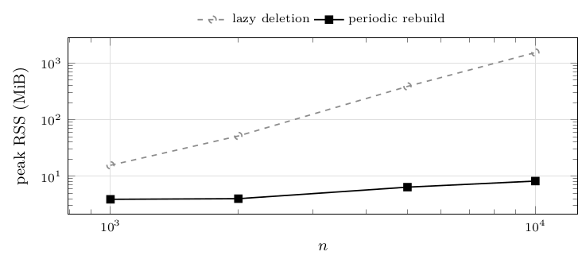

# Implementation note: heap policy

The candidate heaps admit two implementations, indistinguishable in the asymptotic time bound and very different in practice.

- **Lazy deletion (push-only).** Every closure-sum change pushes a fresh entry; stale ones are dropped only when they surface at the top. Heap size is bounded by the number of touch operations, not by $n$. On a star this is pathological: every event touches the hub, each touch re-pushes one entry per incident arc, so the heap accumulates $\Theta(n^2)$ entries.
- **Periodic rebuild (used throughout this study).** Each heap is rebuilt from the live candidates whenever its size exceeds a constant multiple of the live candidate count: amortized $\mathcal O(\log n)$ per operation, worst-case time bound unchanged, memory $\mathcal O(n)$ on *every* input. This is what makes the implementation attain the space bound proved in the manuscript.

**Figure 33.** CPU time in milliseconds and peak RSS in MiB of `HPaC` under the two heap policies, per size; the plot shows the memory column of the table. Instances: `star-mixed`, `independent-positive`, seed 0, $n$ from $1\,000$ to $10\,000$ – one instance per size, one repetition, each algorithm invoked in its own process, which is the only regime in which peak RSS is attributable to a single algorithm ([Setup](04-setup.md)). Observations: the lazy heap's memory grows by a factor of 100 when $n$ grows by 10 – quadratic, as predicted – reaching $1.5$ GiB at $n=10^4$ where the rebuild policy uses $8$ MiB; extrapolating, the lazy policy would exhaust the 8 GiB ceiling by $n\approx20\,000$. The rebuild policy is also $\approx4\times$ faster here (and $\approx2\times$ on large random forests), with bit-identical output on every instance tested, so the two policies are not a trade-off: one dominates. For reference, `PaC`, which maintains no candidate structure, peaks at $5.6$ MiB at $n=10^4$. The practical lesson: on this problem the choice of data structure inside one algorithm is worth as much as the choice between algorithms.

| $n$ | #inst | lazy deletion: ms | MiB | ms | MiB |
|---|---|---|---|---|---|
| 1 000 | 1 | 139.0 | 15.6 | 64.1 | 3.9 |
| 2 000 | 1 | 628.7 | 51.5 | 233.1 | 4.0 |
| 5 000 | 1 | 5 440.9 | 388.0 | 1 422.1 | 6.4 |
| 10 000 | 1 | 27 020.7 | 1 541.2 | 6 396.5 | 8.2 |

---

← [Single orientations](10-single-orientations.md) · [Contents](README.md) · [Comparison with parametric pseudoflow](12-comparison-with-parametric-pseudoflow.md) →
