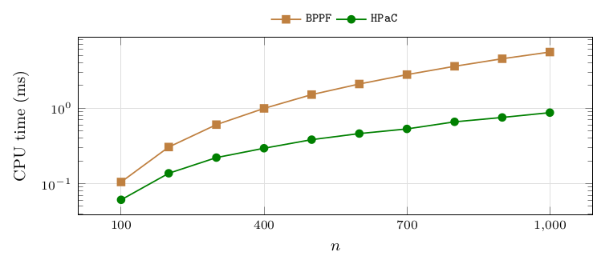

# Comparison with parametric pseudoflow

`BPPF` evaluates minimum cuts at user-supplied parameter values, so the comparison must decide what to supply. We drive it in the setting most favourable to it, identical to the methodology of the manuscript's first version: one `BPPF` process per instance receives, in `BPPF`'s native affine capacity format, the $k+1$ values that bracket all $k$ breakpoints – so it is spared the search for the breakpoints, and one call certifies the whole parametric solution. Timing is `BPPF`'s own internal solve timer (input parsing excluded) against `HPaC`'s in-process time on the same instance; fixed-point precision $10^{-6}$; all 2 400 instances with $n\le1\,000$.

**Figure 34.** Median CPU time in milliseconds of `HPaC` and of `BPPF`, per size: `HPaC`'s in-process time for the full parametric sweep against `BPPF`'s own internal solve timer, input parsing excluded. Instances: `mixed-forest`, $n\in\{100,200,\dots,1\,000\}$, 240 instances per size, 2 400 in total; `BPPF` is given the $k+1$ parameter values bracketing the $k$ breakpoints, in its native affine capacity format, precision $10^{-6}$. Observations: the median paired ratio `BPPF`/`HPaC` grows from $1.5$ at $n=100$ to $4.5$ at $n=1\,000$, overall median $3.3$, even though the breakpoints are handed to `BPPF` for free. Scope: forests with $n\le1\,000$, whereas `BPPF` solves a strictly more general problem on arbitrary precedence graphs, so nothing here transfers outside this class – and recall that on a forest `BPPF`'s bound reads $\mathcal O(n^2\log n)$ ([Table 1](02-the-algorithms-in-one-page.md#table-1)), so the measured factor of a few is far kinder to it than the bounds. The times are sub-millisecond at the small end, which is why the ratio is computed per instance and not from these two columns.

| $n$ | #inst | CPU time (ms): `HPaC` | `BPPF` |
|---|---|---|---|
| 100 | 240 | 0.1 | 0.1 |
| 200 | 240 | 0.1 | 0.3 |
| 300 | 240 | 0.2 | 0.6 |
| 400 | 240 | 0.3 | 1.0 |
| 500 | 240 | 0.4 | 1.5 |
| 600 | 240 | 0.5 | 2.1 |
| 700 | 240 | 0.5 | 2.8 |
| 800 | 240 | 0.7 | 3.6 |
| 900 | 240 | 0.8 | 4.5 |
| 1 000 | 240 | 0.9 | 5.5 |

### Agreement and precision

The closures returned by the two methods agree at every probe on every instance, with one exception class: on **16 of the 2 400 instances** `BPPF` merges two consecutive closure layers whose thresholds differ by less than its fixed-point precision, and therefore does not recover the exact optimal layer sequence. All 16 belong to `near-ties` and `exact-ties`, the two families designed to place thresholds at exactly that distance – which is also why those families exist. Our algorithms are unaffected, comparing integers exactly.

### Discarded variant

An earlier version of this comparison drove `BPPF` once per breakpoint, one process spawn per call. It is reported nowhere: the resulting ratio is dominated by process-creation overhead and says nothing about either algorithm.

---

← [Implementation note: heap policy](11-implementation-note-heap-policy.md) · [Contents](README.md) · [Dispersion of the measurements](13-dispersion-of-the-measurements.md) →
