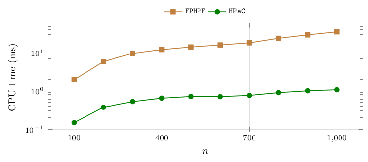
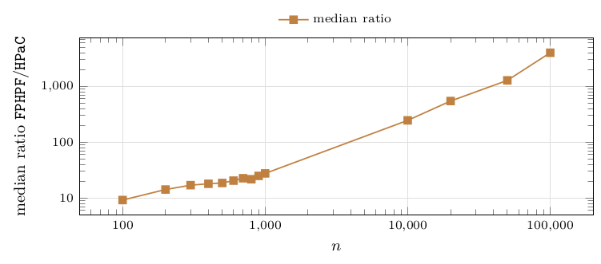

# Comparison with the fully parametric pseudoflow solver

The external baseline is the public implementation of Hochbaum's *fully parametric* pseudoflow algorithm, `FPHPF` (`hochbaumGroup/pseudoflow-parametric-cut-v2`, version 2, May 2025, vendored in `third_party/fphpf/` with its license and a two-line `printf` patch). Unlike a simple parametric solver, which evaluates minimum cuts at parameter values supplied by the caller, `FPHPF` receives the instance and a parameter range only and locates every breakpoint by itself. It therefore solves exactly the problem `HPaC` solves, and the two can be raced with no information passing from one to the other.

### Protocol

Each instance is encoded through the standard maximum-closure/minimum-cut reduction with source- and sink-adjacent capacities affine in the parameter (`tools/convert_to_fphpf.py`; the solver runs on $\mu=-\lambda$ because it requires source capacities non-decreasing in its parameter); the range is $[-\max_i|p_i|-1,\,\max_i|p_i|+1]$, which contains every vertex ratio since $w_i\ge1$. From the solver's output only the partition of the vertices into closure layers is taken, and every breakpoint is recomputed exactly as $\lambda_r=P(\mathcal I_r)/W(\mathcal I_r)$, so no floating-point value produced by `FPHPF` enters the comparison (the solver's reported per-node value is the *upper* bound of the node's first interval, not its threshold – see `third_party/fphpf/UPSTREAM_README.md`). Timing is the solver's own internal solve timer (input parsing excluded) against `HPaC`'s in-process time for the full parametric sweep on the same instance, both as medians of 11 repetitions measured in the same session (2026-09-08, same machine as the sweep). The main comparison runs on all 2 400 `mixed-forest` instances with $n\le1\,000$; an exploratory extension covers $n=10^4$ and $2\cdot10^4$ (24 instances each: six families, four densities, one seed), $5\cdot10^4$ (six instances, $\varrho=0.9$) and $10^5$ (one instance), with a single repetition, since one solver run already takes seconds to minutes there.

**Figure 34.** Median CPU time in milliseconds of `HPaC` and of `FPHPF`, per size, both solving each instance from scratch; “ratio” is the median over the instances of the paired ratio `FPHPF`/`HPaC`. Instances: `mixed-forest`, $n\in\{100,200,\dots,1\,000\}$, 240 per size, 2 400 in total; 11 repetitions per side. Observations: the two methods return the same partition and the same breakpoints on all 2 400 instances, and `HPaC` is faster on every one of them; the median paired ratio grows from $9.2$ at $n=100$ to $27.6$ at $n=1\,000$, overall median $19.5$ (p10 $7.1$, p90 $75.7$). The ratio is largest on sparse forests ($\varrho=0.3$: median $52.5$, many small trees and hence many layers) and smallest on the two tie-stressing families (`exact-ties` $12.1$, `near-ties` $14.7$, fewer layers to separate). Scope: forests, whereas `FPHPF` solves a strictly more general problem on arbitrary precedence graphs; recall that on a forest its bound reads $\mathcal O(n^2\log n)$ ([Table 1](02-the-algorithms-in-one-page.md#table-1)).

| $n$ | #inst | CPU time (ms): `HPaC` | `FPHPF` | ratio |
|---|---|---|---|---|
| 100 | 240 | 0.15 | 1.98 | 9.2 |
| 200 | 240 | 0.37 | 5.85 | 14.2 |
| 300 | 240 | 0.52 | 9.62 | 17.0 |
| 400 | 240 | 0.65 | 12.09 | 18.0 |
| 500 | 240 | 0.71 | 14.11 | 18.6 |
| 600 | 240 | 0.71 | 15.96 | 20.5 |
| 700 | 240 | 0.76 | 18.12 | 22.6 |
| 800 | 240 | 0.90 | 23.79 | 21.7 |
| 900 | 240 | 1.00 | 29.16 | 24.9 |
| 1 000 | 240 | 1.07 | 35.04 | 27.6 |

**Figure 35.** Exploratory extension to larger sizes: median CPU time of `HPaC` (ms) and of `FPHPF` (s), the median paired ratio, and the number of instances on which `FPHPF` returned a coarser partition than `HPaC` (one or more pairs of consecutive layers merged; the $5\cdot10^4$ `correlated` instance lost seven layers). Instances: `mixed-forest`; 24 at $n=10^4$ and $2\cdot10^4$ (all families and densities, seed 0), 6 at $5\cdot10^4$ ($\varrho=0.9$, all families), 1 at $10^5$; single repetition. Observations: the ratio grows roughly as $n^{1.2}$, from about $250$ at $n=10^4$ to about $4\,000$ at $n=10^5$, where one `FPHPF` run takes $15$ minutes against $0.23$ s for `HPaC`. Merges appear from $n=10^4$ on and become systematic (see the paragraph below). Scope: a small sample, meant to show the trend, not to estimate it precisely.

| $n$ | #inst | `HPaC` (ms) | `FPHPF` (s) | ratio | merged |
|---|---|---|---|---|---|
| 10 000 | 24 | 13.3 | 5.0 | 246 | 1/24 |
| 20 000 | 24 | 24.8 | 21.7 | 546 | 2/24 |
| 50 000 | 6 | 100.7 | 143.7 | 1 280 | 2/6 |
| 100 000 | 1 | 227.7 | 910.2 | 3 998 | 1/1 |

### Agreement and precision

On the 2 400 instances with $n\le1\,000$ the two methods return the same partition on every instance, and the breakpoints recomputed from `FPHPF`'s partition coincide with `HPaC`'s exact ones. From $n=10^4$ on, `FPHPF` returns a coarser partition on some instances – consecutive closure layers merged – with a frequency that grows with $n$ ([Figure 35](12-comparison-with-the-fully-parametric-pseudoflow-solver.md#figure-35)). The cause is not double-precision representation but a fixed absolute tolerance in the implementation: `libhpf.c` declares `TOL = 1E-7` and brackets every computed intersection of two linear pieces by lambdaIntersect $\pm$ TOL, so two breakpoints closer than about $2\cdot10^{-7}$ cannot both be found. In the first observed case (`gen_n10000_rho0.9_correlated_seed0`, layers 1421–1422) the two exact thresholds are $2299/2226$ and $2362/2287$, whose difference is $1/5\,090\,862\approx1.96\cdot10^{-7}$; they are perfectly distinct as doubles. Over the 2 400 instances with $n\le1\,000$ the smallest gap between consecutive breakpoints is $2.21\cdot10^{-7}$, just above the threshold, and indeed no merge occurs; as $n$ grows the breakpoints become denser and merges become systematic (all five merges below $n=10^5$ fall on the `correlated` and `independent-positive` families, whose ratios are dense near $1$ and near the middle of the range respectively). Our algorithms are unaffected, comparing integers exactly.

### Caveat stated by the solver's authors

The upstream README (both versions) states that this implementation “does not use free runs nor does it use warm starts with information from previous runs” and “should therefore not be used for comparison with the fully parametric HPF algorithm”. The ratios above therefore characterize the available public implementation, not a bound on what the method could achieve with those refinements.

### Superseded comparison

Every earlier version of this study (and of the manuscript) compared against `hochbaumGroup/Bounded-precision-simple-parametric`, the bounded-precision *simple* parametric solver, which only evaluates minimum cuts at caller-supplied parameter values. That comparison had to hand it the $k+1$ probe values bracketing `HPaC`'s own exact thresholds – a protocol that lets it skip the search for the breakpoints and cannot be made self-contained without either a grid of $10^6$–$10^9$ probes or a bisection driver that destroys its warm start. It was withdrawn on 2026-09-08 in favour of the race above; its data are in git history at tag `v0.3.0` (campaign G) and are cited nowhere.

---

← [Implementation note: heap policy](11-implementation-note-heap-policy.md) · [Contents](README.md) · [Dispersion of the measurements](13-dispersion-of-the-measurements.md) →
