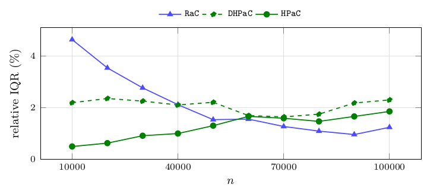
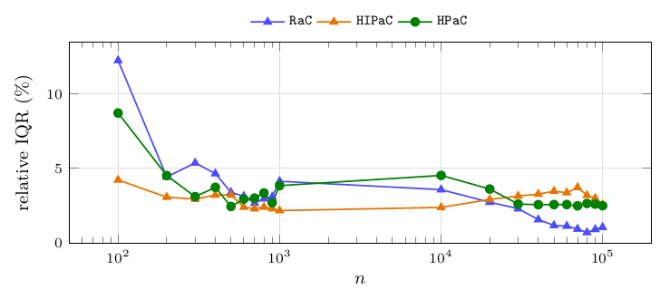

# Dispersion of the measurements

Every ratio reported above is a median over instances of a median over repetitions. This section reports the second-level dispersion – how much the repetitions of a single instance differ from each other – because that is the noise floor against which every claimed difference has to be read. It is expressed as the relative IQR ([Definitions and conventions](03-definitions-and-conventions.md)): the IQR over the repetitions of one instance, divided by that instance's median time.

**Figure 35.** Median relative IQR of the timing, in percent, per size: for each instance, the IQR over its repetitions divided by its own median time, then the median of that over instances. Instances: `mixed-forest`, $n\in\{10\,000,\dots,100\,000\}$, 240 instances per size, 3 repetitions each. Observations: $0.5\%$ to $1.8\%$ for `HPaC`, $1.6\%$ to $2.3\%$ for `DHPaC`, and $4.6\%$ falling to $1.2\%$ for `RaC` – the longer a run, the smaller its relative noise, which is why the largest sizes are the quietest. This is the number that says how much of a reported difference is signal: every ratio in this report is at least an order of magnitude larger than the measurement noise it rests on. The single exception is the near-tie $0.91$ against $1$ at $n=100$ in [Medium sizes: direct scan versus heap](08-random-forests.md#medium-sizes-direct-scan-versus-heap), which is for that reason reported as a near-tie and not as an advantage.

| $n$ | #inst | median relative IQR of the timing (%): `HPaC` | `DHPaC` | `RaC` |
|---|---|---|---|---|
| 10 000 | 240 | 0.5 | 2.2 | 4.6 |
| 20 000 | 240 | 0.6 | 2.3 | 3.5 |
| 30 000 | 240 | 0.9 | 2.2 | 2.8 |
| 40 000 | 240 | 1.0 | 2.1 | 2.1 |
| 50 000 | 240 | 1.3 | 2.2 | 1.5 |
| 60 000 | 240 | 1.7 | 1.7 | 1.5 |
| 70 000 | 240 | 1.6 | 1.6 | 1.3 |
| 80 000 | 240 | 1.5 | 1.7 | 1.1 |
| 90 000 | 240 | 1.7 | 2.2 | 1.0 |
| 100 000 | 240 | 1.8 | 2.3 | 1.2 |

**Figure 36.** Median relative IQR of the timing, in percent, per size, defined as in [Figure 35](13-dispersion-of-the-measurements.md#figure-35). Instances: `in-forest`, $n$ from $100$ to $100\,000$, 240 instances per size, 3 repetitions each. Observations: $2.2\%$–$4.2\%$ for `HIPaC` against $2.5\%$–$8.7\%$ for the general `HPaC`, so the specialized variant is at least as stable as the algorithm it replaces and its advantage is not an artefact of variance; `RaC` goes from $12.3\%$ at $n=100$ down to $1.1\%$ at $n=10^5$. Noise is largest at $n=100$, where a run lasts tens of microseconds and the timer resolution starts to show; from $n=200$ on every algorithm stays below $6\%$, an order of magnitude below the $1.5$–$4.7\times$ effects measured in [Single orientations](10-single-orientations.md).

| $n$ | #inst | median relative IQR of the timing (%): `HPaC` | `HIPaC` | `RaC` |
|---|---|---|---|---|
| 100 | 240 | 8.7 | 4.2 | 12.3 |
| 200 | 240 | 4.5 | 3.1 | 4.4 |
| 300 | 240 | 3.1 | 2.9 | 5.4 |
| 400 | 240 | 3.7 | 3.2 | 4.7 |
| 500 | 240 | 2.5 | 3.2 | 3.4 |
| 600 | 240 | 3.0 | 2.4 | 3.1 |
| 700 | 240 | 3.0 | 2.3 | 2.7 |
| 800 | 240 | 3.4 | 2.4 | 3.0 |
| 900 | 240 | 2.7 | 2.3 | 3.1 |
| 1 000 | 240 | 3.9 | 2.2 | 4.1 |
| 10 000 | 240 | 4.5 | 2.4 | 3.6 |
| 20 000 | 240 | 3.6 | 2.9 | 2.7 |
| 30 000 | 240 | 2.6 | 3.2 | 2.3 |
| 40 000 | 240 | 2.6 | 3.3 | 1.6 |
| 50 000 | 240 | 2.6 | 3.5 | 1.2 |
| 60 000 | 240 | 2.6 | 3.4 | 1.1 |
| 70 000 | 240 | 2.5 | 3.7 | 0.9 |
| 80 000 | 240 | 2.7 | 3.2 | 0.7 |
| 90 000 | 240 | 2.6 | 3.0 | 0.9 |
| 100 000 | 240 | 2.5 | 2.6 | 1.1 |

---

← [Comparison with parametric pseudoflow](12-comparison-with-parametric-pseudoflow.md) · [Contents](README.md) · [Per-family detail at every size](14-per-family-detail-at-every-size.md) →
