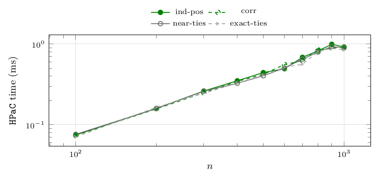
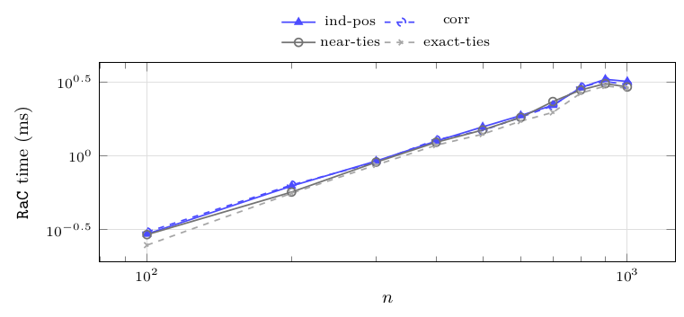
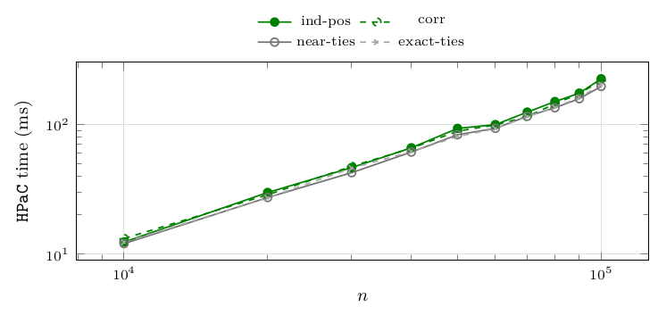
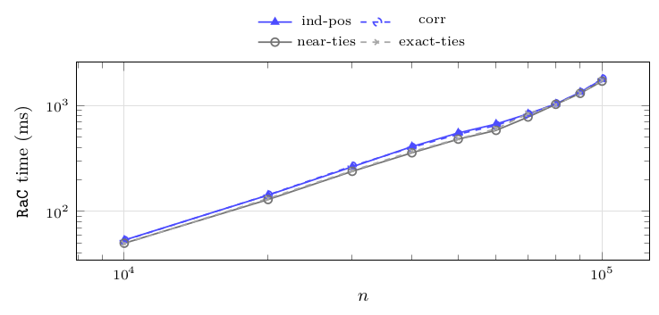

# Per-family detail at every size

The full cross-tabulation behind every by-family statement above: median CPU time per coefficient family and per size, for the two headline algorithms, on both random campaigns. The family ordering is stable across sizes – the two tie-stressing families are consistently the fastest for both algorithms, by a margin that widens with $n$ (at $n=10^5$, `near-ties` costs `HPaC` about $12\%$ less than `independent-positive`) – and no family ever reverses the relative standing of the two algorithms. The plots show four representative families to stay readable; the tables give all six.

**Figure 37.** Median CPU time of `HPaC` in milliseconds, one column per coefficient family and one row per size. Instances: `mixed-forest`, $n\in\{100,\dots,1\,000\}$, all four densities, 40 instances per cell. The plot shows four of the six families, the table all six. Observations: at these sizes all times are sub-millisecond and the six families are indistinguishable at the reported resolution – the largest gap at any size is one tenth of a millisecond, i.e. the last digit. The family effect exists but needs $n\ge10^4$ to be measurable ([Figure 39](14-per-family-detail-at-every-size.md#figure-39)); this table is here to show that it is *not* measurable below that, so no conclusion in [Medium sizes: direct scan versus heap](08-random-forests.md#medium-sizes-direct-scan-versus-heap) rests on it.

| $n$ | #inst | median `HPaC` CPU time (ms) per family: `anti` | `corr` | `exact` | `ind-pos` | `ind-sgn` | `near` |
|---|---|---|---|---|---|---|---|
| 100 | 40 | 0.1 | 0.1 | 0.1 | 0.1 | 0.1 | 0.1 |
| 200 | 40 | 0.2 | 0.2 | 0.2 | 0.2 | 0.2 | 0.2 |
| 300 | 40 | 0.2 | 0.2 | 0.2 | 0.3 | 0.2 | 0.3 |
| 400 | 40 | 0.3 | 0.3 | 0.3 | 0.4 | 0.4 | 0.3 |
| 500 | 40 | 0.4 | 0.4 | 0.4 | 0.4 | 0.5 | 0.4 |
| 600 | 40 | 0.6 | 0.6 | 0.5 | 0.5 | 0.5 | 0.5 |
| 700 | 40 | 0.6 | 0.6 | 0.6 | 0.7 | 0.7 | 0.7 |
| 800 | 40 | 0.9 | 0.8 | 0.8 | 0.8 | 0.8 | 0.8 |
| 900 | 40 | 0.9 | 0.9 | 0.9 | 1.0 | 1.0 | 0.9 |
| 1 000 | 40 | 0.9 | 0.9 | 0.8 | 0.9 | 0.9 | 0.9 |

**Figure 38.** Median CPU time of `RaC` in milliseconds, one column per coefficient family and one row per size. Instances: `mixed-forest`, $n\in\{100,\dots,1\,000\}$, all four densities, 40 instances per cell. The plot shows four of the six families, the table all six. Observations: the same picture as [Figure 37](14-per-family-detail-at-every-size.md#figure-37) a factor of three higher, with the families within $0.5$ ms of each other at $n=1\,000$. Every family shows the same dip from $n=900$ to $n=1\,000$ ($3.5$ to $3.1$ ms for `anti-correlated`), and so does `HPaC`, while the number of closure layers keeps growing ($470$ to $528$) and `PaC` keeps growing with it. We attribute the two elevated sizes to memory-bandwidth contention between the parallel lanes of the sweep ([Setup](04-setup.md)), which touches the two memory-bound algorithms and not the scan-based one; the effect is $\approx10\%$, an order of magnitude below every ratio reported in this document, and it is visible only in this per-cell breakdown.

| $n$ | #inst | median `RaC` CPU time (ms) per family: `anti` | `corr` | `exact` | `ind-pos` | `ind-sgn` | `near` |
|---|---|---|---|---|---|---|---|
| 100 | 40 | 0.3 | 0.3 | 0.2 | 0.3 | 0.3 | 0.3 |
| 200 | 40 | 0.6 | 0.6 | 0.6 | 0.6 | 0.6 | 0.6 |
| 300 | 40 | 0.9 | 0.9 | 0.9 | 0.9 | 0.9 | 0.9 |
| 400 | 40 | 1.3 | 1.3 | 1.2 | 1.3 | 1.2 | 1.2 |
| 500 | 40 | 1.5 | 1.5 | 1.4 | 1.6 | 1.5 | 1.5 |
| 600 | 40 | 1.9 | 1.8 | 1.7 | 1.9 | 1.9 | 1.8 |
| 700 | 40 | 2.2 | 2.2 | 2.0 | 2.2 | 2.4 | 2.3 |
| 800 | 40 | 2.9 | 2.9 | 2.7 | 2.9 | 2.9 | 2.8 |
| 900 | 40 | 3.5 | 3.2 | 3.0 | 3.3 | 3.3 | 3.1 |
| 1 000 | 40 | 3.1 | 3.0 | 2.9 | 3.2 | 3.1 | 2.9 |

**Figure 39.** Median CPU time of `HPaC` in milliseconds, one column per coefficient family and one row per size. Instances: `mixed-forest`, $n\in\{10\,000,\dots,100\,000\}$, all four densities, 40 instances per cell. The plot shows four of the six families, the table all six. Observations: here the family effect is measurable and consistent – the two tie-stressing families (`near-ties`, `exact-ties`) occupy the two fastest columns at 9 of the 10 sizes, and `anti-correlated` or `independent-signed` the slowest – with a spread between fastest and slowest family of $8$–$17\%$ that neither grows nor shrinks with $n$. Compare [Figure 4](05-instances.md#figure-4): `near-ties` produces $27\times$ fewer closure layers than `independent-signed` at these sizes, yet costs only about $10\%$ less time – so the per-layer cost is far from constant, and most of `HPaC`'s work at $n=10^5$ is proportional to $n$ (building and rebuilding the heaps) rather than to the number of breakpoints.

| $n$ | #inst | median `HPaC` CPU time (ms) per family: `anti` | `corr` | `exact` | `ind-pos` | `ind-sgn` | `near` |
|---|---|---|---|---|---|---|---|
| 10 000 | 40 | 13.4 | 13.2 | 12.3 | 12.4 | 13.0 | 12.0 |
| 20 000 | 40 | 29.1 | 28.7 | 27.1 | 29.8 | 29.6 | 27.3 |
| 30 000 | 40 | 49.6 | 47.5 | 46.0 | 46.5 | 48.5 | 42.4 |
| 40 000 | 40 | 66.4 | 65.4 | 61.6 | 66.0 | 64.7 | 61.2 |
| 50 000 | 40 | 91.1 | 88.6 | 80.7 | 93.1 | 87.9 | 83.2 |
| 60 000 | 40 | 100.4 | 98.9 | 92.8 | 99.5 | 100.1 | 93.2 |
| 70 000 | 40 | 116.5 | 114.9 | 114.9 | 124.4 | 125.5 | 115.5 |
| 80 000 | 40 | 144.8 | 143.9 | 135.3 | 149.9 | 149.2 | 134.4 |
| 90 000 | 40 | 174.9 | 172.8 | 161.0 | 174.2 | 183.6 | 157.9 |
| 100 000 | 40 | 229.5 | 217.3 | 202.3 | 224.7 | 224.2 | 196.3 |

**Figure 40.** Median CPU time of `RaC` in milliseconds, one column per coefficient family and one row per size. Instances: `mixed-forest`, $n\in\{10\,000,\dots,100\,000\}$, all four densities, 40 instances per cell. The plot shows four of the six families, the table all six. Observations: the family spread is $5$–$11\%$, comparable to `HPaC`'s, and the ordering is the same, which is why the paired ratio of [Figure 17](08-random-forests.md#figure-17) is flat: the two algorithms react to the coefficients in the same way. `RaC`'s growth over this range is the steepest of any algorithm here – a factor $33$ ($53$ to $1\,766$ ms) for a $10\times$ increase in $n$, against a factor $17$ for `HPaC` – which is consistent with its being the only algorithm whose space is $\mathcal O(n\log n)$: past a few tens of thousands of vertices its top-tree structures no longer fit in cache and every contraction round pays main-memory latency. We report this as an interpretation, not as a measurement: we did not instrument cache misses.

| $n$ | #inst | median `RaC` CPU time (ms) per family: `anti` | `corr` | `exact` | `ind-pos` | `ind-sgn` | `near` |
|---|---|---|---|---|---|---|---|
| 10 000 | 40 | 52.8 | 53.0 | 49.4 | 53.3 | 53.1 | 49.8 |
| 20 000 | 40 | 143.2 | 142.6 | 132.1 | 142.2 | 142.1 | 129.1 |
| 30 000 | 40 | 266.5 | 267.8 | 242.2 | 263.5 | 265.7 | 238.7 |
| 40 000 | 40 | 409.0 | 402.0 | 366.8 | 409.2 | 412.7 | 357.4 |
| 50 000 | 40 | 558.3 | 535.2 | 484.4 | 551.0 | 548.1 | 481.0 |
| 60 000 | 40 | 669.3 | 649.0 | 602.8 | 668.8 | 663.7 | 582.7 |
| 70 000 | 40 | 831.8 | 824.6 | 839.3 | 835.4 | 832.4 | 779.2 |
| 80 000 | 40 | 1 036.9 | 1 040.8 | 1 020.4 | 1 036.0 | 1 034.7 | 1 027.5 |
| 90 000 | 40 | 1 318.6 | 1 329.2 | 1 311.8 | 1 337.4 | 1 329.0 | 1 304.3 |
| 100 000 | 40 | 1 768.8 | 1 792.4 | 1 735.5 | 1 765.6 | 1 753.1 | 1 701.3 |

---

← [Dispersion of the measurements](13-dispersion-of-the-measurements.md) · [Contents](README.md) · [Reproducing this report](15-reproducing-this-report.md) →
